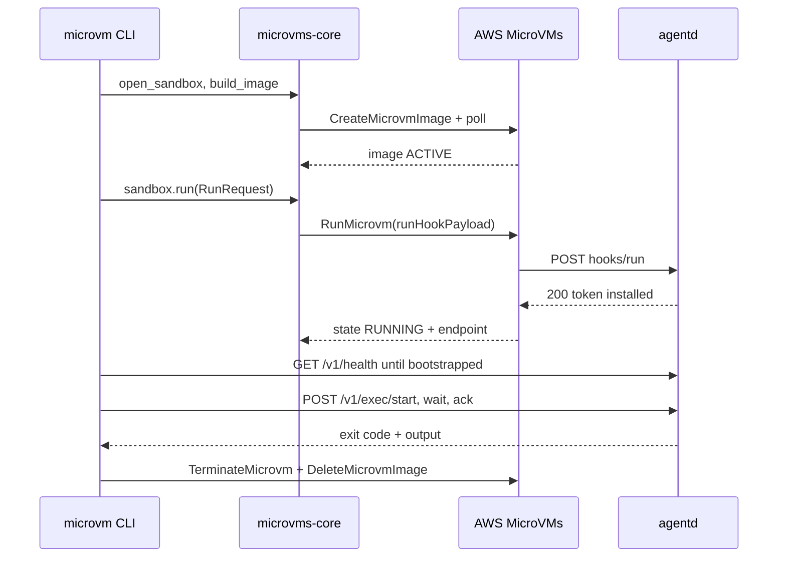
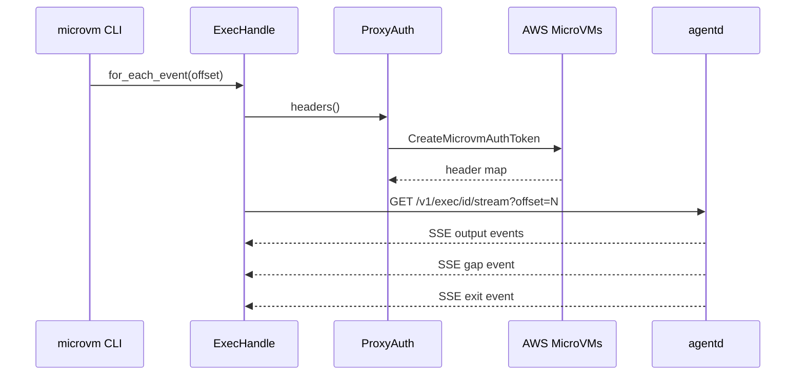
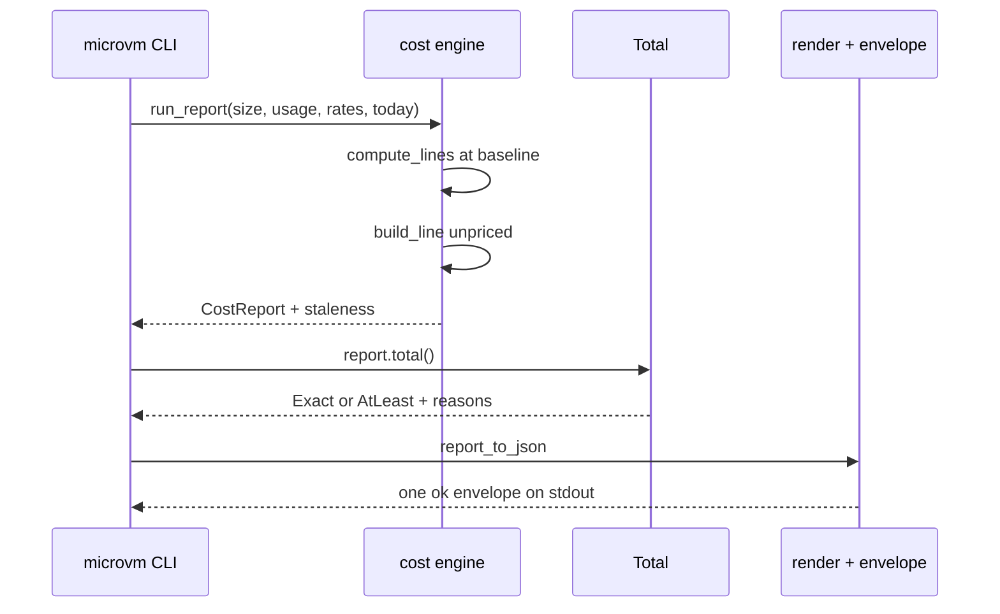

# microvms-agentd · Data flow

This document describes three flows, chosen from the 16 arms of the CLI's dispatch match
(`microvms-cli/src/main.rs:374-396`). Flow 1 is the system's main operation and the only path
that launches a VM. Flow 2 is the streaming read path, and its correctness rests on a resumable
cursor that crosses the endpoint proxy. Flow 3 is the only load-bearing path that ends in the
renderer rather than at the platform, and it touches no account.

Participants are the workspace crates plus the two external actors. `microvm CLI` is
`microvms-cli`. `agentd` is the in-VM daemon. `AWS MicroVMs` is the control plane and its
endpoint proxy.

## Flow 1: microvm run — build, launch, bootstrap, exec, tear down

1. `commands::lifecycle::run` resolves the region, size class, and image name, then checks every
   precondition before anything is created, so a missing role surfaces immediately rather than
   45 minutes into a build (`microvms-cli/src/commands/lifecycle.rs:119`).
2. It opens a `Sandbox` through the AWS seam and races `launch_and_exec` against ctrl-c in a
   `tokio::select!`, so an interrupt still reaches teardown
   (`microvms-cli/src/commands/lifecycle.rs:180-200`).
3. `launch_and_exec` uploads the artifact, then `Sandbox::build_image` issues `CreateMicrovmImage`
   and polls the image to a usable state (`microvms-core/src/sandbox.rs:482`).
4. `Sandbox::run` mints the agent token, wraps it in a typed `RunHookPayload`, and rejects a
   second bootstrap on the same sandbox, so bootstrap runs at most once per VM lifetime
   (`microvms-core/src/sandbox.rs:521`).
5. `ControlPlane::run_microvm` puts the payload on the wire as `runHookPayload` with a
   `clientToken` minted from a scope label, then splits ingress and egress connectors by intent
   (`microvms-core/src/control/microvm.rs:287`).
6. The platform calls the daemon's `/run` hook over loopback; `run_hook` unwraps the envelope,
   parses the inner JSON for `agent_token`, and installs it once. An identical replay returns
   200, and a different token returns 409 (`agentd/src/routes.rs:172`).
7. `wait_for_running` polls to RUNNING and fails fast on a terminal state, then the client polls
   `/v1/health` until `bootstrapped` is true
   (`microvms-core/src/control/microvm.rs:348`, `microvms-core/src/session/mod.rs:295`).
8. The optional workload runs through `Session::run_sync`, which starts the command, waits for
   it, and acks the result. `tear_down` and `attach_cost` then run whether the body succeeded or
   failed (`microvms-core/src/session/mod.rs:361`, `microvms-cli/src/commands/lifecycle.rs:370`).

## Flow 2: microvm exec --stream — SSE output on a byte-offset cursor

1. `commands::attached::exec` attaches a `Session` from the identifier triple, starts the command
   under a caller-minted `exec_id`, then branches to `stream_exec`
   (`microvms-cli/src/commands/attached.rs:107`).
2. `stream_exec` drives `ExecHandle::for_each_event` with a `FnMut(ExecEvent) -> ControlFlow<()>`
   callback rather than a `Stream`, so the CLI needs no futures crate. It reads `nextOffset`
   off core's cursor instead of tallying its own
   (`microvms-cli/src/commands/attached.rs:236`).
3. `ExecHandle::for_each_event` loops over the reconnect state machine, taking the cursor from
   the machine, and returns `EndReason::Cut` when a body ends without an `exit` event
   (`microvms-core/src/session/exec.rs:325`).
4. On a retryable failure, `advance` re-attaches at the last good cursor with backoff. It
   advances the cursor only past bytes actually handed over
   (`microvms-core/src/session/exec.rs:378`).
5. `ExecHandle::attach` issues `GET /v1/exec/{id}/stream?offset=N` with
   `accept: text/event-stream`, minting proxy headers inside the request path so a mid-stream
   reconnect re-mints an expired token (`microvms-core/src/session/exec.rs:509`).
6. `ProxyAuth::headers` serves the cached token or mints one under a lock, re-checking after the
   lock so two racing tasks do not burn two control-plane calls
   (`microvms-core/src/session/proxy.rs:349`).
7. The daemon's `stream` handler snapshots the replay ring, reads terminal state after the
   snapshot, and wraps the event stream in SSE with a keepalive plus `x-accel-buffering: no` so a
   buffering proxy cannot batch the stream to exit (`agentd/src/exec.rs:455`).
8. `build_stream` drains the replayed backlog then the live broadcast channel, emits a `gap` when
   a subscriber lags, and closes the body one step after the terminal `exit` event
   (`agentd/src/exec.rs:560`).

## Flow 3: microvm cost — measured durations to a labelled envelope

1. `commands::cost::cost` reads the pinned rate table and today's UTC date, both passed in as
   values so a report is a pure function of its inputs
   (`microvms-cli/src/commands/cost.rs:27`).
2. Every negative duration is rejected up front with `ERR_INVALID_ARG`, before the constructor
   that a filtered-out phase would have skipped
   (`microvms-cli/src/commands/cost.rs:44-62`).
3. Measured seconds are wrapped as `DurationP::Measured`. The `--estimate` path goes through
   `PlanUsage`, which has no field a measured value can be written into
   (`microvms-core/src/cost.rs:431`, `microvms-core/src/cost.rs:1872`).
4. `run_report` emits line items in lifecycle order (build, image storage, launch snapshot read,
   compute, suspended storage, cycle transfers) and attaches the staleness warning to the report
   itself (`microvms-core/src/cost.rs:1776`).
5. `compute_lines` bills baseline vCPU and baseline memory, never the peak the guest reports
   (`microvms-core/src/cost.rs:1584`).
6. `build_line` is always `Amount::Unpriced` because AWS does not publish whether the
   server-side image build is billed. The line appears with its reason instead of being omitted
   (`microvms-core/src/cost.rs:1699`).
7. `Total::of` routes any unpriced amount to `Total::AtLeast`, carrying the floor beside the
   reasons, so a lower bound cannot be read as an exact figure
   (`microvms-core/src/cost.rs:734`).
8. `render::report_to_json` serializes money as exact decimal strings and durations as numbers,
   and `envelope::ok` wraps it. The envelope is written exactly once, from `main::run`
   (`microvms-cli/src/render.rs:60`, `microvms-cli/src/envelope.rs:314`).

## See also

- [microvms-agentd · Processes](../behavior/processes.md)
- [microvms-agentd · Contract map](../insights/contract-map.md)
- [microvms-agentd · Debugging guide](../insights/debugging-guide.md)
- [microvms-agentd · Business logic](../insights/business-logic.md)
- [microvms-agentd · System overview](system-overview.md)
