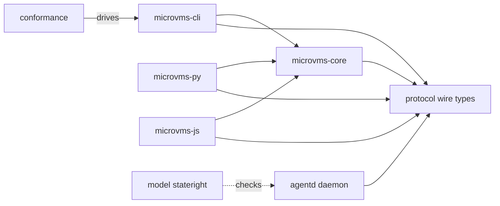

# microvms-agentd · System overview

AWS Lambda MicroVMs hands you an isolated Firecracker VM and no way to run anything inside
it: the service has no exec API and no file-transfer API (`docs/PLATFORM.md:12`). Every
harness that wraps the service therefore has to write its own in-VM daemon to supply both.
This repository is that daemon, plus the client stack that drives it and the verification
harness that checks both. The daemon is a static binary intended to run as the
container `CMD` inside the VM (`agentd/src/main.rs:4`). The client is a library that
handles the platform's known failure modes in one place, so callers do not have to handle
each one themselves. The code calls these failure modes traps
(`microvms-core/src/lib.rs:5-14`). The audience is whoever builds a sandbox product on
MicroVMs, such as an agent harness, a CI runner, or a code-execution service.

The workspace declares seven members (`Cargo.toml:2-10`) plus a live conformance suite.
`protocol` is the wire contract expressed as Rust types. It contains pure data and depends
only on serde and schemars; it deliberately excludes tokio, axum, and base64. The rule for
membership is that a type belongs here if it is what travels over the wire, while machinery
for making it travel lives elsewhere (`protocol/src/lib.rs:16-21`, 600 LOC). Both the daemon and the client
compile against it, so a renamed field breaks the other side's build rather than a
consumer's runtime (`agentd/Cargo.toml:10-14`).

`agentd` is the daemon. It has ten modules, and their seams follow defect classes rather
than the HTTP surface (`agentd/src/lib.rs:31-40`, 11988 LOC). `state` owns the one-shot
bootstrap, `auth` decides authorization before a body byte is read, `exec` owns idempotent
exec, and `fs` owns streaming tar. `serve` is generic over the listener so that tests can
simulate faults. The router is assembled by walking the same endpoint list that
`/v1/schema` publishes, so a documented route with no handler panics at startup
(`agentd/src/routes.rs:29-34`). There are eighteen routes in total: six platform lifecycle
hooks under a fixed prefix, six `/v1/exec/*` routes, four `/v1/fs/*` routes, a health
route, and a schema route (`agentd/src/routes.rs:112-137`).

`microvms-core` is the client library and the largest crate (20608 LOC). Its own doc
comment splits it into two groups: `error`, `region`, `sizing`, `hooks`, and `constants`
form the foundation, while `cost`, `control`, `session`, and `sandbox` form the product
surface (`microvms-core/src/lib.rs:59-63`). `control` speaks hand-signed SigV4 rest-json
and closes each trap before the request leaves the process
(`microvms-core/src/control/mod.rs:13-29`). `session` is the in-VM client, with proxy auth
and a resumable byte cursor (`microvms-core/src/session/mod.rs:1-7`). `sandbox` is the
lifecycle state machine, and its private fields mirror the verified model
(`microvms-core/src/sandbox.rs:9-17`). `cost` represents money as decimals, and it uses a
distinct variant rather than zero when a resource is unpriced
(`microvms-core/src/cost.rs:22-27`).

`microvms-cli` ships the `microvm` binary. It has 16 subcommands, and each invocation
writes one JSON envelope to stdout with progress on stderr (`microvms-cli/src/cli.rs:97-215`,
`microvms-cli/src/envelope.rs:4-11`). It has no lib target, so nothing can depend on it.
Its direct dependency set is an allowlist of exactly six names, and a test that reads
`cargo metadata` asserts the list (`microvms-cli/Cargo.toml:9-42`). AWS is reachable only
through `microvms-core`. `microvms-py` and `microvms-js` wrap that same core through PyO3
and napi-rs rather than through the CLI (`microvms-py/Cargo.toml:22-26`).

Verification lives in two more places. `model` is a stateright model of the bootstrap and
exec lifecycle. It has one dependency and no edge to any workspace member, because it
models the protocol rather than importing it (`model/Cargo.toml:8-9`). `conformance/run_rs.py` drives the built CLI
against real AWS through 77 named checks (`conformance/run_rs.py:8-10`). Start reading at
`agentd/src/lib.rs` for the trust boundary, then `microvms-core/src/lib.rs` for the trap
ladder.

## Stack

| Layer | Technology | Source |
| --- | --- | --- |
| Language | Rust, edition 2024, resolver 3, stable toolchain | `Cargo.toml:23`, `Cargo.toml:11`, `rust-toolchain.toml:14` |
| Shipping target | `aarch64-unknown-linux-musl` static binary, size-tuned release profile | `rust-toolchain.toml:16`, `Cargo.toml:30-31` |
| Daemon HTTP | `axum = "0.8.9"` with `tower-http` `limit` + `catch-panic` | `agentd/Cargo.toml:15`, `agentd/Cargo.toml:24` |
| Async runtime | `tokio = "1.53"`, current-thread in the daemon | `agentd/Cargo.toml:25`, `agentd/src/main.rs:24-27` |
| AWS control plane | `reqwest` on rustls plus hand-rolled `aws-sigv4` signing | `microvms-core/Cargo.toml:75`, `microvms-core/Cargo.toml:69` |
| Wire schema | `schemars = "1.2.2"`, `preserve_order` off so the artifact is reproducible | `protocol/Cargo.toml:15` |
| Money | `rust_decimal` with `serde-with-str` | `microvms-core/Cargo.toml:45` |
| CLI surface | `clap` derive plus `ratatui` for the interactive view | `microvms-cli/Cargo.toml:61`, `microvms-cli/Cargo.toml:65` |
| Bindings | `pyo3` `abi3-py39` via maturin; `napi = "3"` with `async` | `microvms-py/Cargo.toml:38`, `microvms-js/Cargo.toml:30` |
| Verification | `stateright`, `turmoil`, `proptest`; live suite in PEP 723 Python | `model/Cargo.toml:9`, `agentd/Cargo.toml:75`, `conformance/run_rs.py:1-5` |
| Build and gates | `mise` tasks; `check` is the definition of done | `mise.toml:203-205` |

## Module map

## See also

- [microvms-agentd · Impact analysis](../insights/impact-analysis.md)
- [microvms-agentd · Module map](module-map.md)
- [microvms-agentd · Contract map](../insights/contract-map.md)
- [microvms-agentd · Tech debt](../insights/tech-debt.md)
- [microvms-agentd · Public API](../reference/public-api.md)
