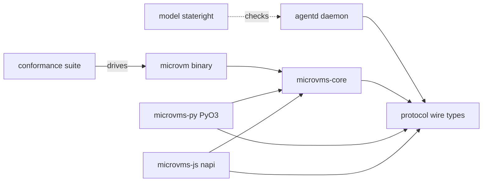

# microvms-agentd · System overview

AWS Lambda MicroVMs hands you an isolated Firecracker VM and no way to use it: there is no
API to run a command inside one and no API to move a file into or out of one
(`docs/PLATFORM.md:20-23`). Every harness built on the service has to supply both itself.
This repository is that supply — `agentd`, a static daemon baked into the VM image, plus the
`microvm` CLI and the Rust, Python, and Node libraries that talk to it (`README.md:11-15`).
Nothing is published: `publish = false` sits in `[workspace.package]` and every member
inherits it (`Cargo.toml:32`), so consumers build the two binaries from source. The audience
is whoever builds a sandbox product on MicroVMs — an agent harness, a CI runner, a
code-execution service.

The client's real work is absorbing the platform's surprises once. `docs/PLATFORM.md`
records seventeen measured findings, fifteen of which a client can act on, and most are
traps in the specific sense that the platform's answer points away from the cause: an
unsupported region answers `AccessDeniedException` with a null message, a `clientToken`
replay wedges an image in `CREATING` for fifteen hours with no error at all
(`microvms-core/src/lib.rs:7-14`). Each closure is ranked by strength — S1 inexpressible, S2
rejected locally before any call, S3 correct by default and overridable
(`microvms-core/src/lib.rs:23-40`).

Seven crates carry that (`Cargo.toml:2-10`), and the seams follow defect classes rather than
layers. `protocol` is the wire contract as types: pure data, serde plus schemars, no tokio,
no axum, no base64 (`protocol/src/lib.rs:16-21`, 66 LOC). Both the daemon and the client
compile against it, so a renamed field fails a build instead of a consumer's runtime
(`agentd/Cargo.toml:11-15`). `agentd` is the daemon, ten modules across 13,659 LOC
(`agentd/src/lib.rs:31-40`, 43 LOC) — `state` owns the one-shot bootstrap, `auth` decides
before a body byte is read, `exec` and `fs` own idempotent exec and streaming tar. Its
router is assembled by walking the same endpoint list `/v1/schema` publishes, so a
documented route with no handler panics at startup (`agentd/src/routes.rs:29-35`, 807 LOC);
there are eighteen, split into a Bearer-guarded `control` router and an `open` one
(`agentd/src/routes.rs:51-59`, `agentd/src/routes.rs:110-140`). It runs as the container
`CMD` on a current-thread runtime sized for a 512 MiB guest (`agentd/src/main.rs:4-6`,
`agentd/src/main.rs:24-27`).

`microvms-core` is the client library and the largest crate — 30,903 LOC over 26 files, nine
modules its own doc comment splits into foundation and product surface
(`microvms-core/src/lib.rs:61-73`). `control` speaks hand-signed SigV4 rest-json because
`lambda-microvms` has no SDK crate (`microvms-core/src/control/mod.rs:2-3`); `session` is
the in-VM client, carrying proxy auth and the byte-offset cursor that makes an interrupted
stream resumable (`microvms-core/src/session/mod.rs:4-7`); `sandbox` keeps every lifecycle
field private so the Z3 proofs are proofs about the code
(`microvms-core/src/sandbox.rs:11-17`); `cost` treats unpriced as a distinct variant rather
than zero (`microvms-core/src/cost.rs:22-27`).

`microvms-cli` ships `microvm` with seventeen subcommands
(`microvms-cli/src/cli.rs:93-229`, 1,723 LOC), each invocation writing exactly one JSON
envelope to stdout and progress to stderr (`microvms-cli/src/envelope.rs:4-11`). It has no
lib target (`microvms-cli/Cargo.toml:10-20`) and exactly six direct dependencies, asserted
against `cargo metadata` (`microvms-cli/Cargo.toml:22-43`). `microvms-py` and `microvms-js`
wrap the same core and never the CLI (`microvms-py/Cargo.toml:22-26`,
`microvms-js/Cargo.toml:20-21`). Verification sits outside the product graph: `model` has
one dependency and no workspace edge, modelling the protocol rather than importing it
(`model/Cargo.toml:9-10`), and `conformance/run_rs.py` drives the built CLI through 77 named
checks against real AWS (`conformance/run_rs.py:9`, 2,355 LOC). Start at
`agentd/src/lib.rs:9-29` for the trust boundary, then `microvms-core/src/lib.rs:21-40` for
the trap ladder.

## Stack

| Layer | Technology | Source |
| --- | --- | --- |
| Language | Rust, `edition = "2024"`, `resolver = "3"` | `Cargo.toml:23`, `Cargo.toml:11` |
| Toolchain and targets | `channel = "stable"`, `targets = ["aarch64-unknown-linux-musl", "x86_64-unknown-linux-musl"]` | `rust-toolchain.toml:13-16` |
| Shipping artifact | `lto`, `codegen-units = 1`, `panic = "unwind"`, `strip`, `opt-level = "z"` | `Cargo.toml:36-59` |
| Daemon HTTP | `axum = "0.8.9"`; `tower-http` `"0.6"` with `limit` + `catch-panic` | `agentd/Cargo.toml:16`, `agentd/Cargo.toml:25` |
| Async runtime | `tokio = "1.53"`, no `rt-multi-thread` in the daemon or the library | `agentd/Cargo.toml:26`, `microvms-core/Cargo.toml:104` |
| AWS control plane | `reqwest = "0.13"` on `rustls`, `aws-sigv4 = "1.5"`, `aws-config = "1.10"` | `microvms-core/Cargo.toml:76`, `microvms-core/Cargo.toml:70`, `microvms-core/Cargo.toml:59` |
| Wire schema | `schemars = "1.2.2"`, `default-features = false`, `derive` + `std` only | `protocol/Cargo.toml:16` |
| Money | `rust_decimal = "1.42"` with `serde-with-str` | `microvms-core/Cargo.toml:46` |
| CLI surface | `clap = "4.6.6"` with `derive`; `ratatui = "0.30.2"` | `microvms-cli/Cargo.toml:55`, `microvms-cli/Cargo.toml:59` |
| Bindings | `pyo3 = "0.29"` with `abi3-py39`; `napi = "3"` with `napi5` + `async` + `web_stream` | `microvms-py/Cargo.toml:38`, `microvms-js/Cargo.toml:44-48` |
| Verification tiers | `stateright = "0.31"`, `turmoil = "0.7.2"`, `proptest = "1.11"` | `model/Cargo.toml:10`, `agentd/Cargo.toml:76`, `agentd/Cargo.toml:73` |
| Live suite | PEP 723 inline script under `uv`, `boto3` + `httpx` | `conformance/run_rs.py:1-5` |
| Build gate | `mise run check` — lint, security, tests, schema, stubs, model drift, build | `mise.toml:290-301` |

## Module map

## See also

- [impact analysis](../insights/impact-analysis.md) — 16 shared source citations
- [contract map](../insights/contract-map.md) — 10 shared source citations
- [dependency graph](../diagrams/structural/dependency-graph.md) — 9 shared source citations
- [module map](module-map.md) — 8 shared source citations
- [business logic](../insights/business-logic.md) — 8 shared source citations
