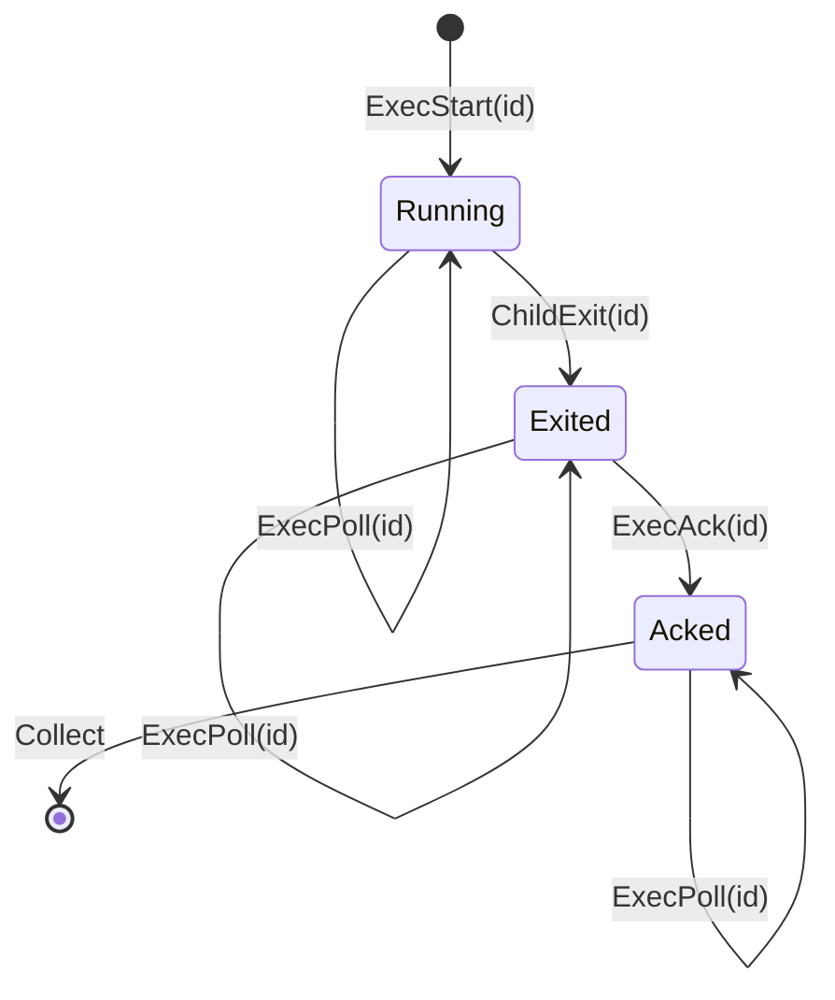
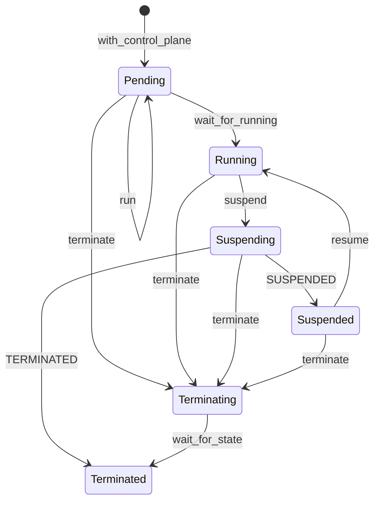
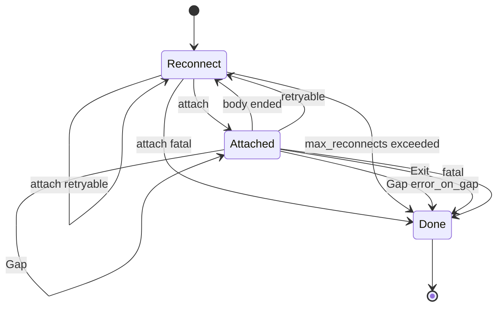

# microvms-agentd · State machines

Three machines. Each is declared once as a Rust enum and mirrored elsewhere by convention
rather than by a cargo dependency, so the mirrors are listed beside each diagram.

## ExecPhase

Where one exec sits in its lifecycle. Three states, and output is held until the caller acks —
which is what makes a retried poll safe.

Transitions:

- Entry: `ExecStart(id)` for an unseen id pushes `Exec { phase: Running, output_held: true,
  spawns: 1, starts: 1 }` — `model/src/lib.rs:357-363`.
- `ExecStart(id)` on a *known* id only increments `starts`; it spawns nothing. That is the
  idempotency contract — `model/src/lib.rs:350-366`. The daemon decides it under the registry
  lock before the spawn, so two concurrent retries cannot both find the slot empty —
  `agentd/src/exec.rs:363-377`.
- `ExecPoll(id)` touches no field of the exec — `model/src/lib.rs:369`. The daemon's handler
  carries the same rule as a comment the model asserts against —
  `agentd/src/exec.rs:402-434`.
- `ChildExit(id)` applies only from `Running`; from any other phase `next_state` returns
  `None` — `model/src/lib.rs:400-408`. On the daemon side the waiter task sets
  `shared.terminal` then `shared.result`, and `result.is_some()` is what reads as `Exited` —
  `agentd/src/exec.rs:1090-1098`.
- `ExecAck(id)` applies only from `Exited`, and also clears `output_held`. From any other
  phase the response is `Conflict` — `model/src/lib.rs:370-379`. The daemon returns 409
  `ERROR_STILL_RUNNING` when the result is absent and 409 `ERROR_ALREADY_ACKED` on a second
  ack — `agentd/src/exec.rs:838-867`.
- `Collect` retains only entries whose phase is not `Acked`, so `Acked` is the one phase an
  entry can be collected from — `model/src/lib.rs:393`. TTL collection on the daemon keeps
  any entry whose `acked_at` is `None`, however old — `agentd/src/exec.rs:932-943`.
- `kill` is not a transition. It signals the process group; the phase moves only when the
  child actually exits — `agentd/src/exec.rs:886-921`.

Mirrors, both by convention:

- `protocol/src/exec.rs:24-31` — `Phase { Running, Exited, Acked }`, `rename_all =
  "snake_case"`, so the wire names are `running` / `exited` / `acked`
  (`protocol/src/exec.rs:313`). Doc comment: "Mirrors `ExecPhase` in the model crate."
- `agentd/src/exec.rs:1108-1116` — `phase_of(acked, finished)`. The daemon stores no phase
  field; it derives the phase from `acked_at.is_some()` and `result.is_some()`.

Model-checked invariants over the whole reachable state space
(`model/src/lib.rs:463-478`): `output is never released before ack`, `a retried start never
spawns twice` (`spawns == 1`), `one exec entry per id`. Coverage `sometimes` properties at
`model/src/lib.rs:501-506` prove the checker actually reached `Acked` and a retried start.

Defined at: `model/src/lib.rs:74-81`

## Lifecycle

One MicroVM's whole life, held as a private field whose only mutations are the five methods
of `Sandbox`. The six states are the symspec's `vm_state`, verbatim.

Transitions:

- Entry: `with_control_plane` starts at `Pending` — `microvms-core/src/sandbox.rs:417`.
- `run` sets `Pending` once `run_microvm` is accepted (STATE-1), then `Running` after
  `wait_for_running` returns, which is also where `token_installed` is set and
  `bootstrap_count` incremented (STATE-2, STATE-3) —
  `microvms-core/src/sandbox.rs:568-593`.
- `suspend` sets `Suspending` *before* the wire call, because the call was accepted (STATE-4)
  — `microvms-core/src/sandbox.rs:639`.
- The suspend wait settles on either `SUSPENDED` or `TERMINATED`, both of which the client
  asked for: a VM the launch-time `idlePolicy` killed mid-suspension lands directly in
  `Terminated` and also sets `was_terminated` — `microvms-core/src/sandbox.rs:660-675`.
- `resume` sets `Running` after the wait, then rebinds the session with the endpoint the
  service just reported (STATE-8) — `microvms-core/src/sandbox.rs:741-749`.
- `terminate` sets `Terminating` before the call, so a terminate whose call fails still marks
  the VM as one this client asked to destroy — `microvms-core/src/sandbox.rs:814-815`. It
  reaches `Terminated` only when the optional `wait_for_state(&["TERMINATED"])` succeeds
  (STATE-10) — `microvms-core/src/sandbox.rs:833-841`. When that wait fails the lifecycle
  deliberately stays at `Terminating` — `microvms-core/src/sandbox.rs:843-848`.

Guards, all of which refuse before any control-plane call:

- `run` twice is refused on `bootstrap_count > 0 || microvm.is_some()` (STATE-3) —
  `microvms-core/src/sandbox.rs:525-534`.
- `suspend` is refused unless the lifecycle is `Running` (STATE-5) —
  `microvms-core/src/sandbox.rs:628-636`.
- `resume` is refused when `was_terminated` or the lifecycle is `Terminated` (STATE-11) —
  `microvms-core/src/sandbox.rs:708-714` — and unless the lifecycle is `Suspended` (STATE-7)
  — `microvms-core/src/sandbox.rs:715-720`.
- `resume` past the launch-time `suspendedDurationSeconds` window is refused with
  `ErrorKind::WindowClosed` (STATE-12) — `microvms-core/src/sandbox.rs:768-792`.

`Lifecycle::as_str` maps each state to the uppercase name the service uses, which is also
what an error message prints — `microvms-core/src/sandbox.rs:114-123`. `Lifecycle::is_live`
is true for `Pending`, `Running`, `Suspending`, `Suspended`, and is read only by the `Drop`
warning about a VM still billing — `microvms-core/src/sandbox.rs:126-131`,
`microvms-core/src/sandbox.rs:926-943`.

Mirrors:

- `spec/core.symspec.json` `.stateModel` — `vm_state` is an enum whose domain is exactly
  `PENDING`, `RUNNING`, `SUSPENDING`, `SUSPENDED`, `TERMINATING`, `TERMINATED`, with
  `initial: vm_state = PENDING`, beside the four other variables the `Sandbox` carries:
  `token_installed`, `image_exists`, `was_terminated`, `bootstrap_count`. The twelve
  `STATE-1`..`STATE-12` requirements cited above are EARS sentences in the same document's
  `.requirements`.
- `model/src/client.rs:61-74` — `VmState`, "Mirrors `microvms_core::sandbox::Lifecycle` by
  convention rather than by dependency". Its transitions are driven by
  `Action { LaunchAccepted, HookSucceeded, SuspendRequested, SuspendComplete,
  ResumeRequested { window_open }, ResumeComplete, TerminateRequested, TerminateComplete }`
  — `model/src/client.rs:116-137` — each answered `Issued`, `RefusedLocally`, or `Ignored`
  — `model/src/client.rs:100-108`.

Three invariants are proved by Z3 over the symspec's state model, then restated as
stateright `always` properties over every interleaving of the model's actions
(`model/src/client.rs:13-18`, `microvms-core/src/sandbox.rs:13-17`):

- bootstrap happens at most once — `bootstrap_count <= 1`, `model/src/client.rs:514-516`.
- a suspend from a non-RUNNING state is unreachable — asserted against the counter
  `suspends_outside_running == 0` rather than against the resulting state, because a suspend
  from `Running` and one from `Suspended` both land in `Suspending` —
  `model/src/client.rs:517-526`.
- TERMINATED never returns to RUNNING — `!(was_terminated && vm_state == Running)`,
  `model/src/client.rs:527-529`.

The Z3 pass runs as `symspec check spec/core.symspec.json --reachability-timeout-ms 5000` —
`mise.toml:138-155`.

The third invariant is where model checking found a real hole that reading did not: a resume
issued legally from `Suspended`, then a terminate, then the resume's completion arriving late
put a `was_terminated` VM back in `Running`. The fix is that a completion applies only while
a resume is still in flight *and* the state is still `Suspended`, so the terminate wins —
`model/src/client.rs:164-173`, `model/src/client.rs:451`.

Defined at: `microvms-core/src/sandbox.rs:97-110`

## StreamState

The SSE output stream's cursor machine: where an attach is, how many times it has dropped,
and the byte offset a resume would ask for. One step function serves both the `Stream` and
the callback driver, so there is one implementation of the reconnect rule.

Entry is `Reconnect { cursor: options.offset, attempts: 0 }`, seeded identically by both
drivers — `microvms-core/src/session/exec.rs:276-279` for `stream_with` and
`microvms-core/src/session/exec.rs:333-336` for `for_each_event`. The single step function is
`advance` — `microvms-core/src/session/exec.rs:378-506`.

Out of `Reconnect` — `microvms-core/src/session/exec.rs:387-431`:

- a successful `attach` moves to `Attached` carrying the same cursor and attempt count.
- a retryable `attach` failure re-enters `Reconnect` with `attempts + 1`; a cut connection or
  a failed token mint says nothing about the exec, which is still running server-side.
- a fatal failure — a 404 on a collected entry above all — goes to `Done` with the error,
  because reconnecting can never succeed.
- `attempts > options.max_reconnects` goes to `Done` with a retryable error naming the last
  good offset — `microvms-core/src/session/exec.rs:392-404`.
- `attempts > 0` with `reconnect` off ends the stream without stepping the machine —
  `microvms-core/src/session/exec.rs:388-391`.

Out of `Attached`, on the next decoded `ExecEvent` — `microvms-core/src/session/exec.rs:432-503`:

- `Output` stays `Attached` and advances the cursor to `offset + data.len()`, only past bytes
  actually handed over — `microvms-core/src/session/exec.rs:437-457`.
- `Gap` advances the cursor to `to` unconditionally, so a reconnect does not ask for the
  evicted range again and get told about the same gap forever. It then stays `Attached`, or
  goes to `Done` with an `OutputGap` error when `options.error_on_gap` is set —
  `microvms-core/src/session/exec.rs:458-480`.
- `Exit` goes to `Done`. Its absence is the only thing that distinguishes a cut connection
  from a finished command — `microvms-core/src/session/exec.rs:483-485`,
  `microvms-core/src/session/sse.rs:253-255`.
- a body that ends with no `Exit` event re-enters `Reconnect` with `attempts + 1`, or ends
  the stream when `reconnect` is off — `microvms-core/src/session/exec.rs:487-495`.
- a retryable read error re-enters `Reconnect`; a fatal one goes to `Done`. A parse failure is
  `ErrorKind::Protocol` and therefore not retryable, so a proxy answering an error page is
  not retried `max_reconnects` times — `microvms-core/src/session/exec.rs:496-502`,
  `microvms-core/src/session/exec.rs:644-649`.

`Done` yields nothing and ends the stream — `microvms-core/src/session/exec.rs:386`.
`StreamState::cursor()` returns `None` for `Done` on purpose: `Done` is reached from several
places and inventing a number there would shadow the last real cursor the caller already
holds — `microvms-core/src/session/exec.rs:678-685`.

Which `Done` path was taken is what `for_each_event` reports as `EndReason`
(`microvms-core/src/session/exec.rs:142-153`), and it is a return classification rather than
a state the machine occupies: `Exited` when the terminal `Exit` event was delivered,
`Stopped` when the callback answered `ControlFlow::Break`, `Cut` when the body ended with no
`Exit` event and reconnecting was refused — `microvms-core/src/session/exec.rs:340-372`. The
returned cursor is read off the machine rather than recomputed from the events, so a caller
resuming does not maintain a second cursor that disagrees exactly when a gap arrived —
`microvms-core/src/session/exec.rs:350-355`.

Defined at: `microvms-core/src/session/exec.rs:656-669`

## See also

- [microvms-agentd · Contract map](../insights/contract-map.md)
- [microvms-agentd · Debugging guide](../insights/debugging-guide.md)
- [microvms-agentd · Data flow](../architecture/data-flow.md)
- [microvms-agentd · Module map](../architecture/module-map.md)
- [microvms-agentd · Processes](processes.md)
