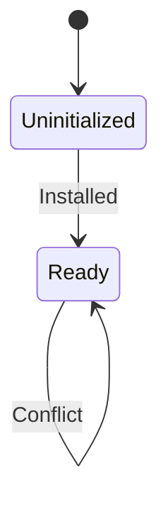
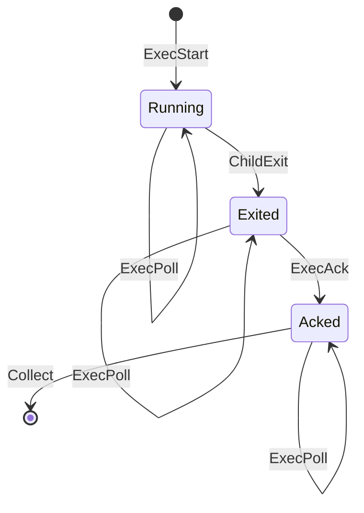
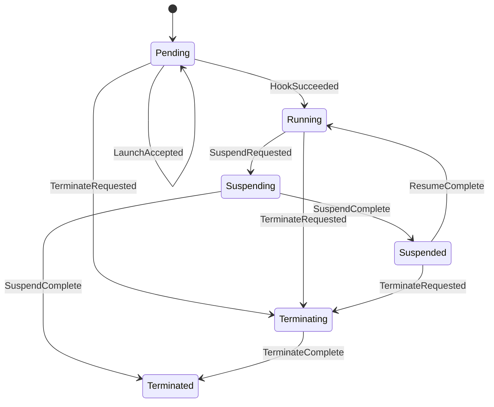
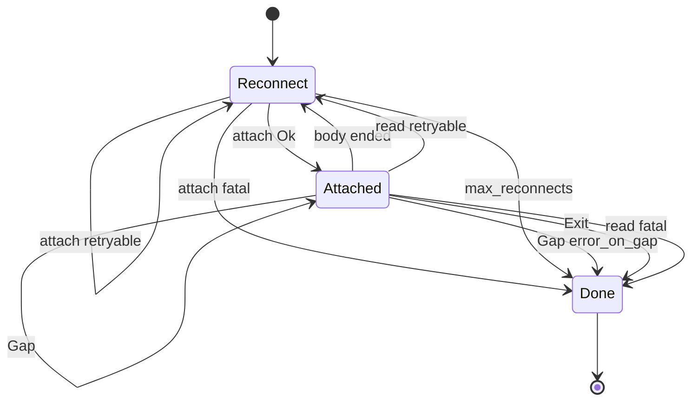

# microvms-agentd · State machines

Four machines, each declared once as a Rust enum. Three of them are also declared formally —
twice over for the VM lifecycle — and the formal declaration is the authority: the `model/`
crate holds `stateright` models whose properties hold over every interleaving
(`model/src/lib.rs:433-517`, `model/src/client.rs:546-699`), and `spec/core.symspec.json`
carries a five-variable state model with a machine-readable transition effect per requirement
(`spec/core.symspec.json:995-1041`).

The models are ordinary `cargo test` targets in the `agentd-model` crate
(`model/Cargo.toml:2`), driven by `.checker().spawn_bfs().join().assert_properties()`
(`model/src/lib.rs:528-534`, `model/src/client.rs:710-716`) and run by `cargo test --all`
(`mise.toml:148`). The Z3 pass over the symspec is a separate task,
`--reachability-timeout-ms 5000` against the v5 CLI (`mise.toml:227`), with the daemon's own
requirements gated by `symspec check spec/agentd.symspec.json --strict` (`mise.toml:207`).

Where a machine is mirrored across crates, the mirror is by convention rather than by a cargo
dependency — `agentd-model` has no edge to `microvms-core` or to `agentd`
(`model/src/client.rs:58-59`) — so each mirror is named beside its diagram.

## Boot

The one-shot bootstrap. Two states, and the whole security argument rests on the fact that only
the first writer can install a token: the platform's own `/run` hook arrives from `127.0.0.1`,
so it is indistinguishable at the socket level from a request sent by a process inside the
MicroVM (`model/src/lib.rs:11-18`).

Entry is `Boot::Uninitialized`, the sole initial state (`model/src/lib.rs:240`). Every edge is in
the `Action::RunHook` arm (`model/src/lib.rs:316-332`):

- `Uninitialized --> Ready` on a first hook. The token and the principal who installed it are
  both recorded, and the response is `Ok` — `model/src/lib.rs:320-323`.
- `Ready --> Ready` when the presented token equals the installed one. Answered `Ok`, because
  the platform may retry its own hook and telling it the VM is broken would fail a launch that
  is fine — `model/src/lib.rs:326-328`.
- `Ready --> Ready` when the presented token differs. Answered `Conflict`; nothing is replaced —
  `model/src/lib.rs:330`.

A control request arriving while `Uninitialized` is answered `Unavailable`, not `Unauthorized`
and never `NotFound`: clients map 404 onto "missing file", so the wrong code turns a protocol
error into a phantom absent artifact — `model/src/lib.rs:334-339`. The daemon's middleware makes
the same three-way distinction, with `token_matches` returning `None` for "not bootstrapped" and
`Some(false)` for "wrong credential" — `agentd/src/auth.rs:69-80`,
`agentd/src/state.rs:245-249`.

Mirrors:

- `agentd/src/state.rs:119` — the daemon stores no state enum. Its bootstrap state is
  `token: Mutex<Option<Vec<u8>>>`, read through `is_bootstrapped()`
  (`agentd/src/state.rs:237-239`), so `None` is `Uninitialized` and `Some` is `Ready`.
  `Bootstrap { Installed, AlreadyIdentical, Conflict }` (`agentd/src/state.rs:96-106`) is the
  outcome of an attempted install, not a state field, which is why its variants are this
  diagram's edge labels. `AppState::bootstrap` decides all three under the token lock
  (`agentd/src/state.rs:202-221`) and `POST /run` maps them to 200/200/409
  (`agentd/src/routes.rs:213-234`).
- `spec/agentd.symspec.json:11-114` — four of its six EARS requirements are this machine:
  install the agent token (`spec/agentd.symspec.json:89`), accept an identical token
  (`spec/agentd.symspec.json:21`), reject a differing token (`spec/agentd.symspec.json:72`), and
  reject a control request while the token is not installed (`spec/agentd.symspec.json:56`).

Two `always` properties hold over the whole reachable space: `bootstrap is one-shot`
(`token_replacements == 0`, `model/src/lib.rs:446-448`) and `control API is closed before
bootstrap` (`model/src/lib.rs:458-465`). `attacker never authorized`
(`model/src/lib.rs:443-445`) is stated unconditionally rather than consulting the config it
discriminates, and the model reports both halves of the deployment invariant: held, the attacker
never gains authority (`model/src/lib.rs:527-534`); broken, `stateright` returns the concrete
path by which it does (`model/src/lib.rs:540-558`). One-shot survives even a racing in-VM
process (`model/src/lib.rs:562-569`).

The launch environment travels in the same payload and is installed only on `Installed`
(`agentd/src/state.rs:210`), under the token lock, so a caller who loses the token cannot win
the environment. It is deliberately never the same slot as the token, because the token's
security property is that it stays out of child environments
(`agentd/src/state.rs:128-134`).

Bootstrap state survives a suspend and resume — measured, not inferred — so `resume` is not an
edge of this machine (`agentd/src/routes.rs:261-290`).

Defined at: `model/src/lib.rs:64-69`

## ExecPhase

Where one exec sits in its lifecycle. Output is held until the caller acks, which is what makes
a retried poll safe (`model/src/lib.rs:71-72`).

Entry: `ExecStart(id)` for an unseen id pushes an entry at `Running` with `output_held: true`,
`spawns: 1`, `starts: 1` — `model/src/lib.rs:357-363`.

- `ExecStart(id)` on a *known* id increments `starts` only; it spawns nothing and touches no
  other field. That is the idempotency contract — `model/src/lib.rs:350-366`. The daemon decides
  it under the registry lock before the spawn, so two concurrent retries cannot both find the
  slot empty — `agentd/src/exec.rs:363-377`.
- `ExecPoll(id)` touches no field — `model/src/lib.rs:367-369`. Read-only is a property of the
  step rather than of any reachable state, so it is asserted against the transition function
  directly (`model/src/lib.rs:574-606`) and the daemon handler carries the same rule
  (`agentd/src/exec.rs:402-434`).
- `ChildExit(id)` applies only from `Running`; from any other phase `next_state` returns `None`
  — `model/src/lib.rs:403-411`. On the daemon the waiter sets `shared.terminal` *before*
  `shared.result`, so a stream that sees the finish immediately finds the terminal marker
  present — `agentd/src/exec.rs:1173-1183`.
- `ExecAck(id)` applies only from `Exited` and clears `output_held`. From any other phase the
  response is `Conflict`, not a silent success that would drop output still being written —
  `model/src/lib.rs:370-379`. The daemon answers 409 `ERROR_STILL_RUNNING` when the result slot
  is empty and `acked_at` is unset, and 409 `ERROR_ALREADY_ACKED` on a second ack; `acked_at` is
  marked while the slot lock is still held so a concurrent duplicate cannot misreport an acked
  exec as running — `agentd/src/exec.rs:837-886`.
- `Collect` retains only entries whose phase is not `Acked`, so `Acked` is the one phase an entry
  can be collected from — `model/src/lib.rs:380-398`. TTL collection on the daemon keeps any
  entry whose `acked_at` is `None`, however old, because collecting it would destroy output the
  caller never read — `agentd/src/exec.rs:951-962`.

`kill` signals the whole process group and leaves the phase alone; the phase moves only when the
child actually exits, so it is not a transition of this machine —
`agentd/src/exec.rs:905-940`.

Mirrors:

- `protocol/src/exec.rs:24-31` — `Phase { Running, Exited, Acked }`, doc comment "Mirrors
  `ExecPhase` in the model crate" (`protocol/src/exec.rs:16`). `rename_all = "snake_case"`
  (`:23`) puts `running` / `exited` / `acked` on the wire, spelled once in `as_str` (`:47-53`)
  with the closed set in `ALL` (`:40`) so a binding publishing the list reads it from the type.
- `agentd/src/exec.rs:1193-1201` — `phase_of(acked, finished)`. The daemon stores no phase field;
  it derives one from `acked_at.is_some()` and `result.is_some()`, asserted exhaustively at
  `agentd/src/exec.rs:2375-2377`.

Three `always` properties hold over the whole reachable space: `output is never released before
ack` (`model/src/lib.rs:466-472`), `a retried start never spawns twice` (`spawns == 1`,
`model/src/lib.rs:473-475`), and `one exec entry per id` (`model/src/lib.rs:476-481`). The first
is audited against itself rather than asserted: the collect predicate flags any entry it would
remove while `output_held` still holds, and acking is the only thing that releases output, so a
collected entry with held output is exactly an exec destroyed without its caller's ack
(`model/src/lib.rs:380-395`). Coverage properties confirm the checker reached `Acked` and a
retried start (`model/src/lib.rs:504-509`).

Defined at: `model/src/lib.rs:74-81`

## Lifecycle

One MicroVM's whole life, as the client tracks it. Six states and no others, which is the point
of the enum: a lifecycle held as a `String` would let `"RUNNING "` and `"Running"` both exist,
and every guard would have to decide which it meant (`microvms-core/src/sandbox.rs:91-95`). The
state is a private field, and the five `Sandbox` methods are the only writers.

Entry is `Lifecycle::Pending` (`microvms-core/src/sandbox.rs:486`), matching the symspec's
`initial` (`spec/core.symspec.json:996`) and the model's sole init state
(`model/src/client.rs:287`).

Edge labels below are the model's `Action` variants (`model/src/client.rs:116-142`), which is the
one vocabulary all three declarations share. Each row gives the symspec key, the symspec's
`stateEffect`, the model arm, and the client site:

- `LaunchAccepted` · `Pending --> Pending` · STATE-1 (`spec/core.symspec.json:690`),
  `when vm_state = PENDING: image_exists := true` (`:698`) · `model/src/client.rs:374-384` ·
  `microvms-core/src/sandbox.rs:696-706`. The lifecycle is set after the wire call returns,
  because acceptance *is* the call succeeding.
- `HookSucceeded` · `Pending --> Running` · STATE-2 (`:371`),
  `... vm_state := RUNNING, token_installed := true, bootstrap_count := bootstrap_count + 1`
  (`:379`) · `model/src/client.rs:388-409` · `microvms-core/src/sandbox.rs:708-726`. This is the
  one place `bootstrap_count` increments (STATE-3, `:881`).
- `SuspendRequested` · `Running --> Suspending` · STATE-4 (`:103`),
  `when vm_state = RUNNING: vm_state := SUSPENDING` (`:112`) · `model/src/client.rs:427-443` ·
  `microvms-core/src/sandbox.rs:769-778`. The assignment follows the call for the same reason:
  moving first would leave a throttled call stuck in a state neither suspend nor resume accepts,
  bricking the handle over one bad request.
- `SuspendComplete` · `Suspending --> Suspended` · STATE-6 (`:550`),
  `when vm_state = SUSPENDING: vm_state := SUSPENDED` (`:558`) · `model/src/client.rs:446-453` ·
  `microvms-core/src/sandbox.rs:794-795`.
- `ResumeRequested` + `ResumeComplete` · `Suspended --> Running` · STATE-7 (`:668`),
  `when vm_state = SUSPENDED: vm_state := RUNNING` (`:677`) · `model/src/client.rs:456-501` ·
  `microvms-core/src/sandbox.rs:859-883`. Nothing is re-delivered: no payload, no token, no
  bootstrap, because the in-memory token survived the freeze and re-delivering it would hit the
  daemon's one-shot bootstrap and be refused (`microvms-core/src/sandbox.rs:818-822`). The
  session rebinds to the endpoint the service just reported, which drops the cached proxy token
  (STATE-8, `:199`).
- `TerminateRequested` · `Pending`/`Running`/`Suspended` `--> Terminating` · STATE-9 (`:571`),
  `when vm_state = PENDING or vm_state = RUNNING or vm_state = SUSPENDED: vm_state :=
  TERMINATING, was_terminated := true` (`:579`) · `model/src/client.rs:504-511` ·
  `microvms-core/src/sandbox.rs:944-949`. Recorded before the call, so a terminate whose call
  fails still marks the VM as one this client asked to destroy.
- `TerminateComplete` · `Terminating --> Terminated` · STATE-10 (`:803`),
  `when vm_state = TERMINATING: vm_state := TERMINATED` (`:811`) ·
  `model/src/client.rs:514-521` · `microvms-core/src/sandbox.rs:967-976`. Reached only when the
  optional `wait_for_state(&["TERMINATED"])` succeeds; when the wait fails the lifecycle stays at
  `Terminating` honestly, because the platform accepted the terminate and the VM is on its way
  out (`microvms-core/src/sandbox.rs:977-982`).

One edge exists in the client with no matching `stateEffect`: the suspend wait settles on
`SUSPENDED` **or** `TERMINATED`, and both are states this client asked for. A VM the launch-time
`idlePolicy` killed mid-suspension lands directly in `Terminated` and also sets `was_terminated`,
which is what then stops a resume from being offered — `microvms-core/src/sandbox.rs:790-809`.
The symspec omits `SUSPENDING` as a terminate source, and that omission is correct rather than a
gap: `suspend(&mut self)` (`microvms-core/src/sandbox.rs:755`) holds the exclusive borrow across
its own wait, so no caller can invoke `terminate(&mut self)` (`:935`) while the lifecycle sits in
`Suspending`. `Suspending` is transient within one call, never a resting state a caller can act
from.

Every guard refuses before any control-plane call is made, and the zero-call refusal is the
assertion rather than the resulting state:

- `run` twice is refused on `bootstrap_count > 0 || microvm.is_some()` (STATE-3) —
  `microvms-core/src/sandbox.rs:649-661`.
- `suspend` is refused unless the lifecycle is `Running` (STATE-5, `spec/core.symspec.json:294`,
  constraint at `:302`) — `microvms-core/src/sandbox.rs:758-767`.
- `resume` is refused when `was_terminated` or the lifecycle is `Terminated` (STATE-11, `:448`,
  constraint at `:456`) — `microvms-core/src/sandbox.rs:840-848` — and unless the lifecycle is
  `Suspended` (STATE-7) — `:849-854`.
- `resume` past the launch-time `suspendedDurationSeconds` window is refused with
  `ErrorKind::WindowClosed` (STATE-12, `:487`) — `microvms-core/src/sandbox.rs:857`,
  `:902-926`. An absent window is *not* a closed one: with either the window or the stamp
  missing the check passes, because that is the attach path where this sandbox did not send the
  launch, and guessing a default would refuse a resume the service would honour
  (`microvms-core/src/sandbox.rs:903-907`; see
  `.erpaval/solutions/architecture-patterns/an-absent-value-is-not-a-neutral-one.md`).
- `suspended_at` is cleared on a successful resume, so the next cycle's window is measured from
  the next suspend rather than accumulating every suspension into one total —
  `microvms-core/src/sandbox.rs:884-887`.

`Lifecycle::as_str` maps each state to the uppercase name the service uses, which is also what an
error message prints — `microvms-core/src/sandbox.rs:112-123`. `Lifecycle::is_live` is true for
`Pending`, `Running`, `Suspending`, `Suspended`, and is read only by the `Drop` warning about a
VM still billing — `microvms-core/src/sandbox.rs:125-131`,
`microvms-core/src/sandbox.rs:1060-1077`.

Mirrors:

- `spec/core.symspec.json:1004-1011` — `vm_state`, an enum whose domain is exactly `PENDING`,
  `RUNNING`, `SUSPENDING`, `SUSPENDED`, `TERMINATING`, `TERMINATED`, beside the four other
  variables the `Sandbox` carries: `token_installed`, `image_exists`, `was_terminated`,
  `bootstrap_count` (`:1012-1040`). The `STATE-1`..`STATE-12` keys cited above are EARS
  sentences in the same document.
- `model/src/client.rs:61-74` — `VmState`, "Mirrors `microvms_core::sandbox::Lifecycle` by
  convention rather than by dependency" (`:58-59`). Its transitions are driven by
  `Action` (`:116-142`), each answered `Issued`, `RefusedLocally`, or `Ignored`
  (`model/src/client.rs:99-108`).

The three invariants Z3 proves over the symspec are restated as `stateright` `always`
properties over every interleaving of the model's actions: `bootstrap happens at most once`
(`model/src/client.rs:554-556`), `no suspend call outside RUNNING`
(`model/src/client.rs:557-566`), and `a terminated VM never reaches RUNNING`
(`model/src/client.rs:567-569`). The second is asserted against the counter
`suspends_outside_running` rather than against the resulting state, because a suspend from
`Running` and one from `Suspended` both land in `Suspending`, so nothing in the post-state
distinguishes them — the first attempt at this property passed while a twelve-step
counterexample existed (`model/src/client.rs:558-565`). Wire-call counts are state variables for
the same reason (`model/src/client.rs:23-34`): "a resume after terminate is rejected" is
satisfied by a client that calls, fails, and burns a poll timeout, so the property that matters
is that no resume call ever fires once `was_terminated` holds
(`model/src/client.rs:584-589`).

Model checking found a defect behind the third invariant that code reading had missed. A resume
issued legally from `Suspended`, then a terminate, then the resume's completion arriving late,
put a `was_terminated` VM back in `Running` — STATE-11 broken by an interleaving no state-only
gate catches. The fix makes a completion apply only while a resume is still in flight *and* the
state is still `Suspended`, so the terminate wins, which is what the client does: `terminate`
clears the session and the lifecycle before anything else — `model/src/client.rs:175-184`,
`model/src/client.rs:483-501`, `model/src/client.rs:509`.

Each guard is proved falsifiable rather than merely green. Under `Config::guards_skipped`
(`model/src/client.rs:247-252`) the client issues a suspend outside RUNNING, a resume after a
terminate, and a resume with the window closed, and `stateright` hands back each path —
`model/src/client.rs:726-745`, `:750-763`, `:768-774`. Every `always` property has a `sometimes`
property beside it (`model/src/client.rs:647-697`) so none can pass over a space that never
reached the interesting state.

Defined at: `microvms-core/src/sandbox.rs:97-110`

## StreamState

The SSE output stream's cursor machine. It tracks where an attach is, how many times it has
dropped, and the byte offset a resume would ask for. Written as a generator over an explicit
state machine rather than a hand-rolled `Stream` impl, because the reconnect logic is a loop with
an `await` in the middle and expressing that as a `poll_next` would mean storing the in-flight
attach as a pinned field — where a self-referential-future bug lives
(`microvms-core/src/session/exec.rs:290-294`). The enum is private, so it has no mirror.

Entry is `Reconnect { cursor: options.offset, attempts: 0 }`, seeded identically by both drivers:
`stream_with` at `microvms-core/src/session/exec.rs:299-303` and `for_each_event_async` at
`:412-415`. `for_each_event` (`:347`) delegates to the async form (`:359`), so both consumers run
one step function, `advance` — `microvms-core/src/session/exec.rs:460-588`. `attempts` is zero
for the first attach, which is why the backoff and the max-reconnect check are both skipped there
(`:739-740`).

Out of `Reconnect`:

- a successful `attach` moves to `Attached` carrying the same cursor and attempt count — `:491-498`.
- a retryable `attach` failure re-enters `Reconnect` with `attempts + 1`. A cut connection or a
  failed token mint says nothing about the exec, which is still running server-side — `:499-507`.
- a fatal failure goes to `Done` with the error, because reconnecting can never succeed. A 404 on
  a collected entry is the case that matters — `:508-511`.
- `attempts > options.max_reconnects` goes to `Done` with a retryable error naming the last good
  offset — `:474-486`.
- `attempts > 0` with `reconnect` off ends the stream without stepping the machine — `:470-473`.

Out of `Attached`, on the next decoded `ExecEvent`:

- `Output` stays `Attached` and advances the cursor to `offset + data.len()`, only past bytes
  actually handed over — `:519-539`.
- `Gap` advances the cursor to `to` unconditionally, so a reconnect does not ask for the evicted
  range again and receive the same gap forever. It then stays `Attached`, or goes to `Done` with
  a `WireKind::OutputGap` error when `options.error_on_gap` is set — `:540-561`. `from` is
  inclusive and `to` exclusive, which is why `to` is where a cursor resumes
  (`microvms-core/src/session/sse.rs:248-252`).
- `Exit` goes to `Done`. A finished command always delivers this event, and its absence is the
  only thing distinguishing a cut connection from a finished command — the byte sequences are
  otherwise identical — `:563-567`, `microvms-core/src/session/sse.rs:253-255`.
- a body that ends with no `Exit` event re-enters `Reconnect` with `attempts + 1`, or ends the
  stream when `reconnect` is off — `:568-577`.
- a retryable read error re-enters `Reconnect`; a fatal one goes to `Done` — `:578-584`. A parse
  failure is `ErrorKind::Protocol`, and `Error::retryable` is true only for
  `ErrorKind::Retryable` (`microvms-core/src/error.rs:116-118`), so a proxy answering an error
  page is not retried `max_reconnects` times, refilling the buffer each pass —
  `microvms-core/src/session/exec.rs:726-731`.

`Done` yields nothing and ends the stream — `:468`. `StreamState::cursor()` returns `None` for
`Done` rather than a number: `Done` is reached from three different places, so any value invented
there could shadow the last real cursor the caller already holds — `:753-767`.

`for_each_event_async` reports which `Done` path was taken as `EndReason`
(`microvms-core/src/session/exec.rs:143-154`). `EndReason` is a return classification, not a
state the machine occupies, so it gets no diagram of its own. It is `Exited` when the terminal
`Exit` event was delivered (`:448-452`), `Stopped` when the callback answered
`ControlFlow::Break` (`:442-447`), and `Cut` when the body ended with no `Exit` event and
reconnecting was refused (`:420-428`) — where the command's outcome is unknown rather than zero,
and a caller reporting success would pass a CI step on evidence it never received (`:150-153`).
The returned cursor is read off the machine through `next.cursor()` rather than recomputed from
the events, so a caller that resumes holds one cursor and not a second one that would agree until
a gap arrived — `:429-434`.

Defined at: `microvms-core/src/session/exec.rs:738-751`

## See also

- [business logic](../insights/business-logic.md) — 9 shared source citations
- [contract map](../insights/contract-map.md) — 8 shared source citations
- [debugging guide](../insights/debugging-guide.md) — 8 shared source citations
- [impact analysis](../insights/impact-analysis.md) — 8 shared source citations
- [processes](processes.md) — 6 shared source citations
