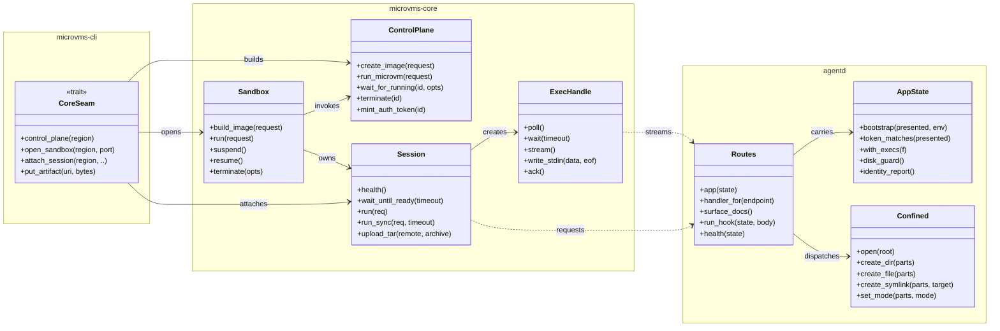

# microvms-agentd · Components

## Legend

| Node or edge | Citations |
| --- | --- |
| `CoreSeam` | trait `microvms-cli/src/seam.rs:136`; methods `microvms-cli/src/seam.rs:138`, `:141`, `:148`, `:172`; `AwsSeam` impl `:179`, `:183`, `:201`, `:225` |
| `Sandbox` | struct `microvms-core/src/sandbox.rs:422`; methods `:551`, `:648`, `:755`, `:837`, `:935` |
| `ControlPlane` | struct `microvms-core/src/control/mod.rs:160`; methods `microvms-core/src/control/image.rs:157`, `microvms-core/src/control/microvm.rs:356`, `:435`, `:563`, `:581` |
| `Session` | struct `microvms-core/src/session/mod.rs:184`; methods `:329`, `:342`, `:380`, `:408`, `:444` |
| `ExecHandle` | struct `microvms-core/src/session/exec.rs:213`; methods `:228`, `:248`, `:285`, `:624`, `:654` |
| `Routes` | module of free functions, not a type: `agentd/src/routes.rs:36`, `:110`, `:371`, `:178`, `:314` |
| `AppState` | struct `agentd/src/state.rs:110`; methods `:202`, `:245`, `:257`, `:176`, `:183` |
| `Confined` | struct `agentd/src/fs.rs:297`; methods `:350`, `:416`, `:428`, `:448`, `:535` |
| `CoreSeam --> ControlPlane` | `microvms-cli/src/seam.rs:138`, impl `:179` |
| `CoreSeam --> Sandbox` | `microvms-cli/src/seam.rs:141`, impl `:183` |
| `CoreSeam --> Session` | `microvms-cli/src/seam.rs:148`, impl `:201` |
| `Sandbox --> ControlPlane` | `microvms-core/src/sandbox.rs:65-67`, `:553`, `:696`, `:773`, `:859`, `:951` |
| `Sandbox --> Session` | `microvms-core/src/sandbox.rs:70`, `:535`, `:648` |
| `Session --> ExecHandle` | `microvms-core/src/session/mod.rs:380`, `:403` |
| `Session ..> Routes` | `microvms-core/src/session/mod.rs:331`, `:382`; `microvms-core/src/session/files.rs:45`, `:52` |
| `ExecHandle ..> Routes` | `microvms-core/src/session/exec.rs:233`, `:592`, `:659` |
| `Routes --> AppState` | `agentd/src/routes.rs:36` |
| `Routes --> Confined` | `agentd/src/routes.rs:132-135`, `agentd/src/fs.rs:1433`, `:1480`, `:631` |
| `..>` dashed | the HTTP wire, not a crate dependency: the shared contract is the `protocol` crate, re-exported at `microvms-core/src/lib.rs:77` and `agentd/src/routes.rs:18-20`, and the permitted directions are asserted by `microvms-cli/tests/dependency_direction.rs` |
| `+` prefix | the class-diagram marker for a listed member, not a Rust visibility claim: `Confined` and its methods are crate-private (`agentd/src/fs.rs:297`, `:350`), as are `routes::run_hook` and `routes::health` (`agentd/src/routes.rs:178`, `:314`) |

## See also

- [impact analysis](../../insights/impact-analysis.md) — 10 shared source citations
- [processes](../../behavior/processes.md) — 9 shared source citations
- [business logic](../../insights/business-logic.md) — 9 shared source citations
- [sequences](../behavioral/sequences.md) — 8 shared source citations
- [data flow](../../architecture/data-flow.md) — 7 shared source citations
