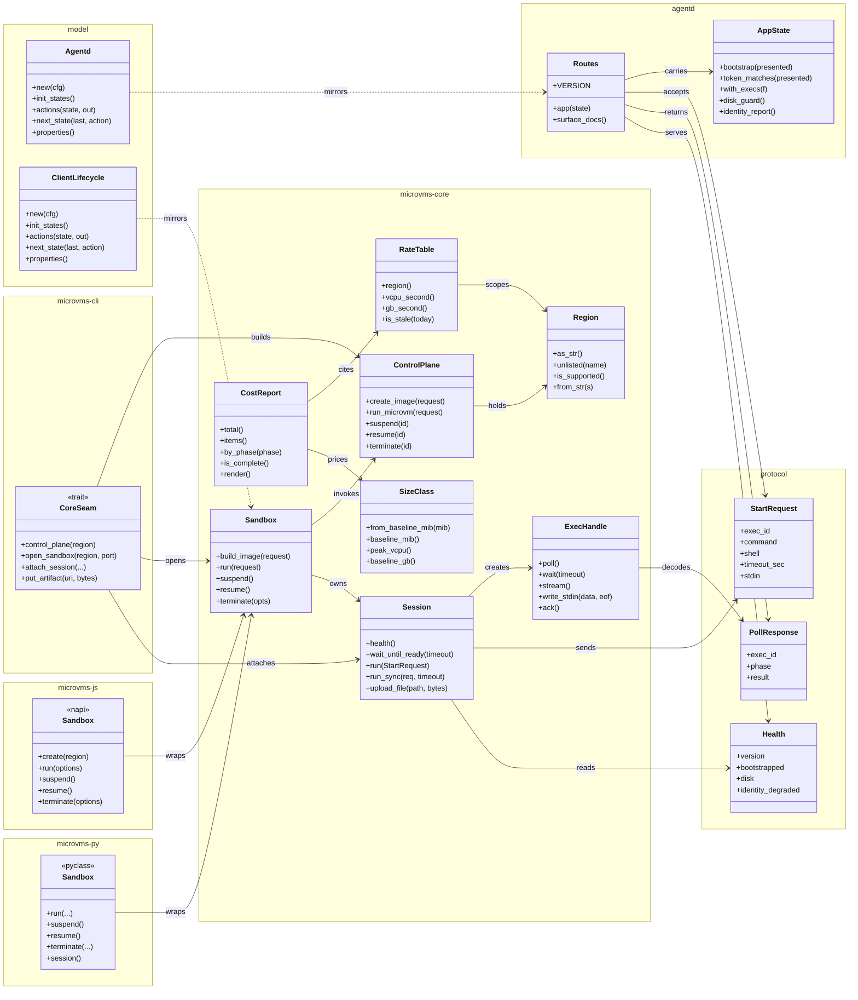

# microvms-agentd · Components

```mermaid
classDiagram
    direction LR

    namespace microvms-core {
        class ControlPlane {
            +create_image(request)
            +run_microvm(request)
            +suspend(id)
            +resume(id)
            +terminate(id)
        }
        class Sandbox {
            +build_image(request)
            +run(request)
            +suspend()
            +resume()
            +terminate(opts)
        }
        class Session {
            +health()
            +wait_until_ready(timeout)
            +run(StartRequest)
            +run_sync(req, timeout)
            +upload_file(path, bytes)
        }
        class ExecHandle {
            +poll()
            +wait(timeout)
            +stream()
            +write_stdin(data, eof)
            +ack()
        }
        class CostReport {
            +total()
            +items()
            +by_phase(phase)
            +is_complete()
            +render()
        }
        class RateTable {
            +region()
            +vcpu_second()
            +gb_second()
            +is_stale(today)
        }
        class Region {
            +as_str()
            +unlisted(name)
            +is_supported()
            +from_str(s)
        }
        class SizeClass {
            +from_baseline_mib(mib)
            +baseline_mib()
            +peak_vcpu()
            +baseline_gb()
        }
    }

    namespace protocol {
        class StartRequest {
            +exec_id
            +command
            +shell
            +timeout_sec
            +stdin
        }
        class PollResponse {
            +exec_id
            +phase
            +result
        }
        class Health {
            +version
            +bootstrapped
            +disk
            +identity_degraded
        }
    }

    namespace agentd {
        class Routes {
            +app(state)
            +surface_docs()
            +VERSION
        }
        class AppState {
            +bootstrap(presented)
            +token_matches(presented)
            +with_execs(f)
            +disk_guard()
            +identity_report()
        }
    }

    namespace model {
        class Agentd {
            +new(cfg)
            +init_states()
            +actions(state, out)
            +next_state(last, action)
            +properties()
        }
        class ClientLifecycle {
            +new(cfg)
            +init_states()
            +actions(state, out)
            +next_state(last, action)
            +properties()
        }
    }

    namespace microvms-cli {
        class CoreSeam {
            <<trait>>
            +control_plane(region)
            +open_sandbox(region, port)
            +attach_session(...)
            +put_artifact(uri, bytes)
        }
    }

    namespace microvms-js {
        class NodeSandbox["Sandbox"] {
            <<napi>>
            +create(region)
            +run(options)
            +suspend()
            +resume()
            +terminate(options)
        }
    }

    namespace microvms-py {
        class PySandbox["Sandbox"] {
            <<pyclass>>
            +run(...)
            +suspend()
            +resume()
            +terminate(...)
            +session()
        }
    }

    Sandbox --> ControlPlane : invokes
    Sandbox --> Session : owns
    ControlPlane --> Region : holds
    Session --> ExecHandle : creates
    Session --> StartRequest : sends
    Session --> Health : reads
    ExecHandle --> PollResponse : decodes
    CostReport --> RateTable : cites
    CostReport --> SizeClass : prices
    RateTable --> Region : scopes
    Routes --> AppState : carries
    Routes --> StartRequest : accepts
    Routes --> PollResponse : returns
    Routes --> Health : serves
    CoreSeam --> ControlPlane : builds
    CoreSeam --> Sandbox : opens
    CoreSeam --> Session : attaches
    NodeSandbox --> Sandbox : wraps
    PySandbox --> Sandbox : wraps
    Agentd ..> Routes : mirrors
    ClientLifecycle ..> Sandbox : mirrors
```
