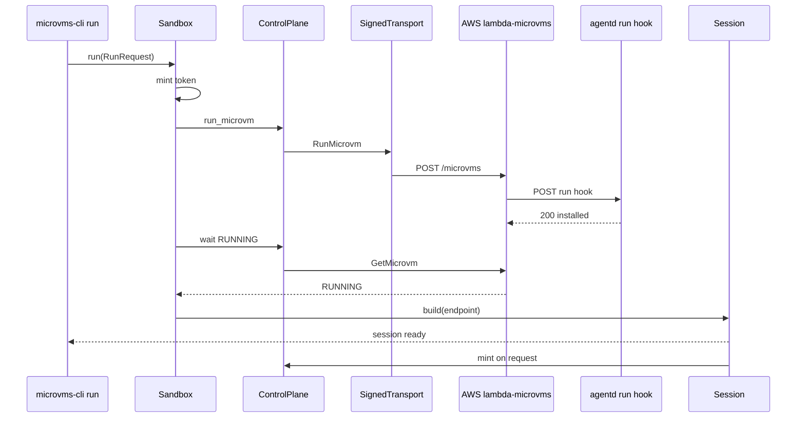
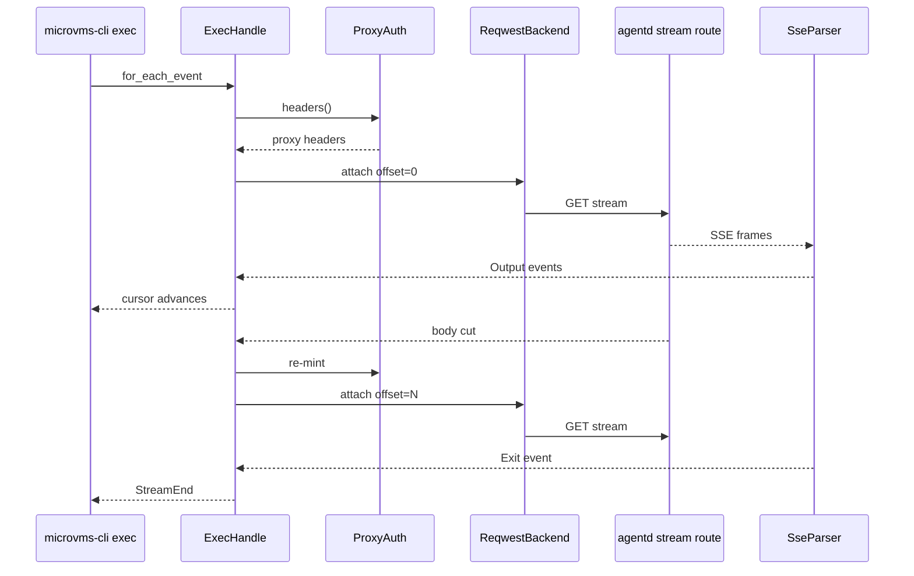
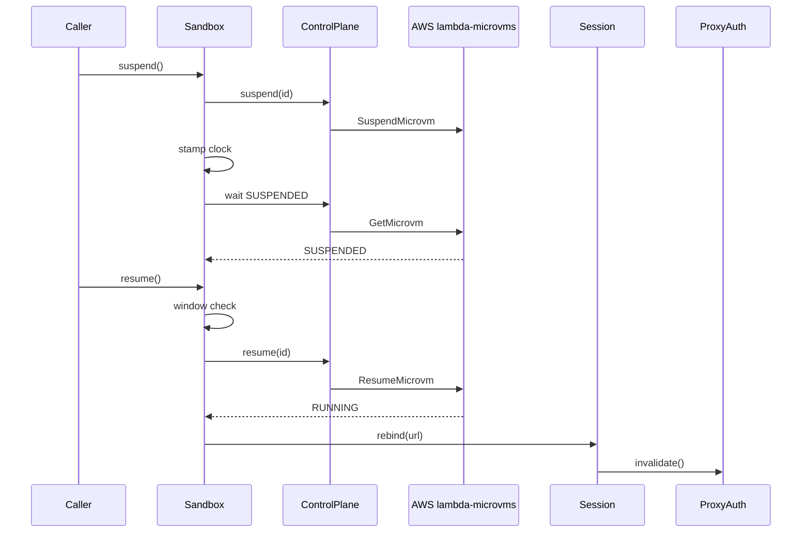

# microvms-agentd · Sequences

## microvm run

```mermaid
sequenceDiagram
    participant CLI as microvms-cli run
    participant Sandbox
    participant Plane as ControlPlane
    participant Wire as SignedTransport
    participant AWS as AWS lambda-microvms
    participant Hook as agentd run hook
    participant Session

    CLI ->> Sandbox: run(RunRequest)
    Sandbox ->> Sandbox: mint token
    Sandbox ->> Plane: run_microvm
    Plane ->> Wire: RunMicrovm
    Wire ->> AWS: POST /microvms
    AWS ->> Hook: POST run hook
    Hook -->> AWS: 200 installed
    Sandbox ->> Plane: wait RUNNING
    Plane ->> AWS: GetMicrovm
    AWS -->> Sandbox: RUNNING
    Sandbox ->> Session: build(endpoint)
    Session -->> CLI: session ready
    Session ->> Plane: mint on request
```

## microvm exec --stream

```mermaid
sequenceDiagram
    participant CLI as microvms-cli exec
    participant Handle as ExecHandle
    participant Auth as ProxyAuth
    participant Backend as ReqwestBackend
    participant Route as agentd stream route
    participant Parser as SseParser

    CLI ->> Handle: for_each_event
    Handle ->> Auth: headers()
    Auth -->> Handle: proxy headers
    Handle ->> Backend: attach offset=0
    Backend ->> Route: GET stream
    Route -->> Parser: SSE frames
    Parser -->> Handle: Output events
    Handle -->> CLI: cursor advances
    Route -->> Handle: body cut
    Handle ->> Auth: re-mint
    Handle ->> Backend: attach offset=N
    Backend ->> Route: GET stream
    Parser -->> Handle: Exit event
    Handle -->> CLI: StreamEnd
```

## suspend and resume

```mermaid
sequenceDiagram
    participant Caller
    participant Sandbox
    participant Plane as ControlPlane
    participant AWS as AWS lambda-microvms
    participant Session
    participant Auth as ProxyAuth

    Caller ->> Sandbox: suspend()
    Sandbox ->> Plane: suspend(id)
    Plane ->> AWS: SuspendMicrovm
    Sandbox ->> Sandbox: stamp clock
    Sandbox ->> Plane: wait SUSPENDED
    Plane ->> AWS: GetMicrovm
    AWS -->> Sandbox: SUSPENDED
    Caller ->> Sandbox: resume()
    Sandbox ->> Sandbox: window check
    Sandbox ->> Plane: resume(id)
    Plane ->> AWS: ResumeMicrovm
    AWS -->> Sandbox: RUNNING
    Sandbox ->> Session: rebind(url)
    Session ->> Auth: invalidate()
```
