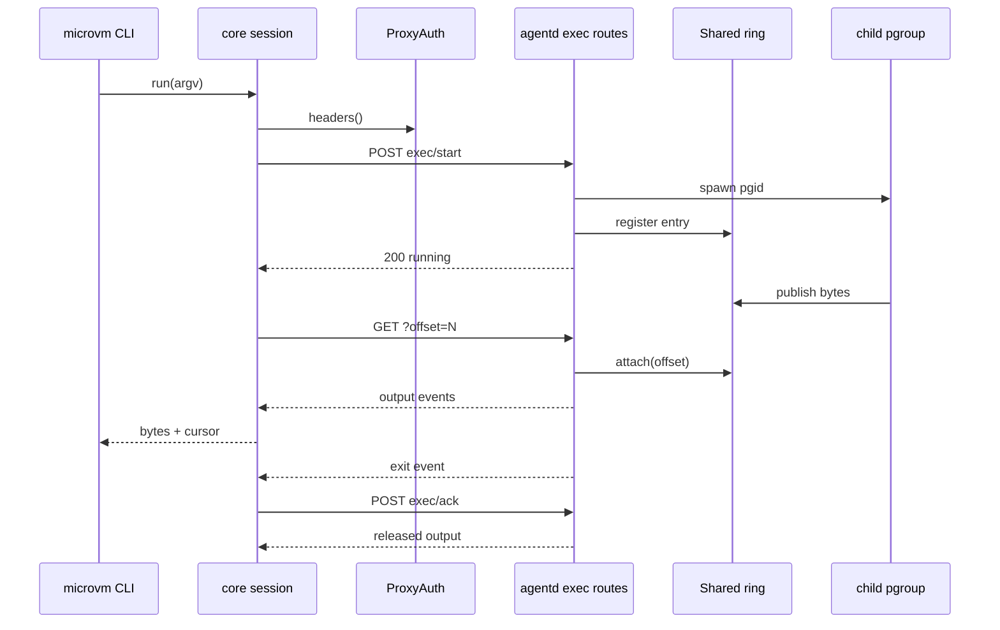
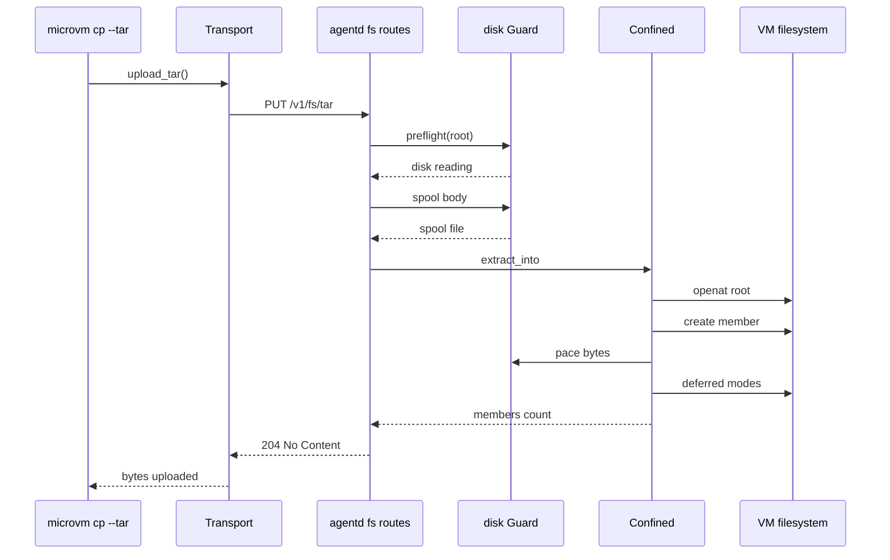
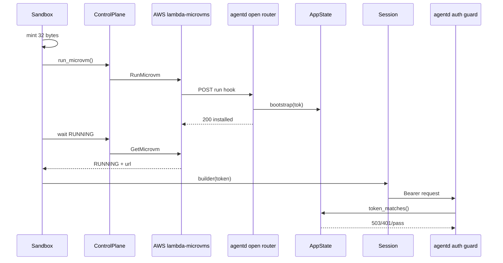

# microvms-agentd · Sequences

Three processes that cross the client/daemon HTTP boundary. Each participant is one module or
one external actor; each edge is one call site.

## Exec start, stream, and ack

Participants:

- `microvm CLI` — the `exec`, `exec --stream`, and `ack` subcommands
  (`microvms-cli/src/commands/attached.rs:103`, `microvms-cli/src/commands/attached.rs:240`,
  `microvms-cli/src/commands/attached.rs:609`).
- `core session` — `Session` plus `ExecHandle`, banded because they share one module
  (`microvms-core/src/session/mod.rs:380`, `microvms-core/src/session/exec.rs:213`).
- `ProxyAuth` — the proxy-token cache whose mint sits inside the request path
  (`microvms-core/src/session/proxy.rs:432`, `microvms-core/src/session/mod.rs:88`).
- `agentd exec routes` — `start`, `stream`, `ack` (`agentd/src/exec.rs:331`,
  `agentd/src/exec.rs:455`, `agentd/src/exec.rs:831`).
- `Shared ring` — the replay ring plus the broadcast channel, keyed by exec id
  (`agentd/src/exec.rs:220`).
- `child pgroup` — the spawned process group (`agentd/src/exec.rs:1113`).

Edges in order:

1. `run(argv)` — `microvms-cli/src/commands/attached.rs:152`.
2. `headers()` — the mint runs inside `Transport::headers`, so every request re-checks freshness
   (`microvms-core/src/session/mod.rs:92`, `microvms-core/src/session/mod.rs:115`).
3. `POST exec/start` — `microvms-core/src/session/mod.rs:382`; the handle is built from the id the
   daemon confirmed (`microvms-core/src/session/mod.rs:394`).
4. `spawn pgid` — the pgid is captured while `Child::id()` still answers
   (`agentd/src/exec.rs:1113`, `agentd/src/exec.rs:1119`).
5. `register entry` — the registry insert makes the id addressable (`agentd/src/exec.rs:1141`).
6. `200 running` — `agentd/src/exec.rs:380`; a retried start returns the same 200 without a second
   child (`agentd/src/exec.rs:366`).
7. `publish bytes` — `Capped::pump` into `Shared::publish`, which appends to the ring and fans out
   live under one lock (`agentd/src/exec.rs:1366`, `agentd/src/exec.rs:255`).
8. `GET ?offset=N` — `ExecHandle::attach` builds `/v1/exec/{id}/stream?offset=`, mints its own
   headers because the streaming path bypasses `Transport::request`, and is re-entered per
   reconnect (`microvms-core/src/session/exec.rs:592`,
   `microvms-core/src/session/exec.rs:600`, `microvms-core/src/session/exec.rs:491`).
9. `attach(offset)` — subscribe-before-snapshot, enforced by one lock so the unsafe order is not
   expressible from the handler (`agentd/src/exec.rs:474`, `agentd/src/exec.rs:293`).
10. `output events` — base64 `output` frames carrying the offset of their first byte
    (`agentd/src/exec.rs:642`); a lagged or evicted range comes through as a typed `gap`
    (`agentd/src/exec.rs:656`).
11. `bytes + cursor` — the cursor advances only past bytes handed over, and past a gap's `to`
    (`microvms-core/src/session/exec.rs:526`, `microvms-core/src/session/exec.rs:543`);
    the CLI writes an NDJSON line plus the raw bytes
    (`microvms-cli/src/commands/attached.rs:268`).
12. `exit event` — the terminal marker is written before the result slot, so a stream that sees
    `Finished` always finds an exit event (`agentd/src/exec.rs:535`,
    `agentd/src/exec.rs:1182`).
13. `POST exec/ack` — `microvms-core/src/session/exec.rs:654`; `wait_and_ack` returns the ack's
    result rather than a post-ack poll (`microvms-core/src/session/exec.rs:687`).
14. `released output` — the result slot is taken once and `acked_at` is set while the slot lock is
    still held (`agentd/src/exec.rs:863`, `agentd/src/exec.rs:867`).

Stdin is a separate request, never multiplexed onto this connection
(`microvms-core/src/session/exec.rs:624`, `agentd/src/exec.rs:682`).

## Tar upload and extraction

Participants:

- `microvm cp --tar` — resolves direction from the `vm:` prefix and inspects no archive
  (`microvms-cli/src/commands/attached.rs:805`, `microvms-cli/src/commands/attached.rs:809`).
- `Transport` — `files::upload_tar` plus the shared send path
  (`microvms-core/src/session/files.rs:98`, `microvms-core/src/session/mod.rs:106`).
- `agentd fs routes` — `write_tar` (`agentd/src/fs.rs:1433`).
- `disk Guard` — the reserve-aware probe, the body spool, and the pacer
  (`agentd/src/fs.rs:1454`, `agentd/src/fs.rs:872`, `agentd/src/disk.rs:170`).
- `Confined` — the `openat2`-based extractor, the one confined write path
  (`agentd/src/fs.rs:297`, `agentd/src/fs.rs:621`).
- `VM filesystem` — the extraction root inside the guest.

Edges in order:

1. `upload_tar()` — `microvms-cli/src/commands/attached.rs:829`.
2. `PUT /v1/fs/tar` — content type `application/x-tar`; the client does not inspect the archive,
   so the daemon's extractor stays the only implementation of the member rules
   (`microvms-core/src/session/files.rs:103`, `microvms-core/src/session/files.rs:94`).
3. `preflight(root)` — run against the extraction root before the body is spooled, so an upload
   aimed at a full filesystem is refused without spending the wire time
   (`agentd/src/fs.rs:1459`).
4. `disk reading` — a reading below the reserve becomes 507 naming the path
   (`agentd/src/fs.rs:1460`, `agentd/src/fs.rs:106`).
5. `spool body` — the archive lands in full before a single member is extracted
   (`agentd/src/fs.rs:1463`, `agentd/src/fs.rs:872`).
6. `spool file` — spool pressure and a truncated body are distinct outcomes, 507 and 400
   (`agentd/src/fs.rs:1469`, `agentd/src/fs.rs:1475`).
7. `extract_into` — inside `spawn_blocking`, because `tar`'s reader is blocking
   (`agentd/src/fs.rs:1479`, `agentd/src/fs.rs:621`).
8. `openat root` — one confined root held for the whole extraction, so a component that turns out
   to be a symlink stops the write instead of redirecting it (`agentd/src/fs.rs:631`,
   `agentd/src/fs.rs:350`).
9. `create member` — `resolve_member` refuses an escaping path and a non-directory naming the root;
   device and fifo members are refused; an absolute link target is refused
   (`agentd/src/fs.rs:679`, `agentd/src/fs.rs:704`, `agentd/src/fs.rs:726`,
   `agentd/src/fs.rs:783`).
10. `pace bytes` — checked after each member lands, and extraction is not transactional by design
    (`agentd/src/fs.rs:803`).
11. `deferred modes` — replayed deepest-first after all content has landed, so a directory packed
    `0o500` does not block the writes into it (`agentd/src/fs.rs:810`,
    `agentd/src/fs.rs:825`).
12. `members count` — `agentd/src/fs.rs:1485`.
13. `204 No Content` — `agentd/src/fs.rs:1487`.
14. `bytes uploaded` — `microvms-cli/src/commands/attached.rs:835`.

## Daemon bootstrap through the run hook

Participants:

- `Sandbox` — the client lifecycle object outside the VM
  (`microvms-core/src/sandbox.rs:675`).
- `ControlPlane` — the signed AWS client (`microvms-core/src/control/microvm.rs:356`).
- `AWS lambda-microvms` — the service, which calls the hook over loopback inside the VM
  (`agentd/src/routes.rs:168`).
- `agentd open router` — the unauthenticated half of the router, holding the lifecycle hooks
  (`agentd/src/routes.rs:48`, `agentd/src/routes.rs:178`).
- `AppState` — the one-shot token slot and the launch-environment map
  (`agentd/src/state.rs:202`).
- `Session` — the client bound to the reported endpoint with the same token
  (`microvms-core/src/sandbox.rs:733`).
- `agentd auth guard` — `require_token`, applied as a `route_layer` over every control route
  (`agentd/src/auth.rs:62`, `agentd/src/routes.rs:66`).

Edges in order:

1. `mint 32 bytes` — 32 bytes of `/dev/urandom` rendered as 64 hex characters, unless the caller
   supplied a token (`microvms-core/src/sandbox.rs:675`,
   `microvms-core/src/sandbox.rs:1101`).
2. `run_microvm()` — the payload is validated before the launch, so an over-ceiling one fails with
   a byte count rather than as a service `ValidationException`
   (`microvms-core/src/sandbox.rs:682`, `microvms-core/src/sandbox.rs:696`).
3. `RunMicrovm` — `microvms-core/src/control/microvm.rs:423`.
4. `POST run hook` — unauthenticated by necessity: the platform has no credential to present, and
   its request arrives over loopback indistinguishably from an in-VM process
   (`agentd/src/routes.rs:168`, `agentd/src/routes.rs:178`). A body that is not JSON is 400,
   never 404 (`agentd/src/routes.rs:187`).
5. `bootstrap(tok)` — the token and the launch environment arrive in one payload and are taken as
   two arguments, so no path can move a byte from the first into the second
   (`agentd/src/routes.rs:213`, `agentd/src/state.rs:202`). The env is installed only for the
   first caller (`agentd/src/state.rs:210`).
6. `200 installed` — an identical replay is also 200, because the platform may retry its own hook;
   a different token is 409 (`agentd/src/routes.rs:224`, `agentd/src/routes.rs:230`).
7. `wait RUNNING` — `microvms-core/src/sandbox.rs:708`.
8. `GetMicrovm` — polled until RUNNING, failing fast on a terminal state
   (`microvms-core/src/control/microvm.rs:459`, `microvms-core/src/control/microvm.rs:465`,
   `microvms-core/src/control/microvm.rs:510`).
9. `RUNNING + url` — RUNNING is what reports the hook succeeded, so this is where
   `token_installed` and `bootstrap_count` move (`microvms-core/src/sandbox.rs:722`).
10. `builder(token)` — the same minted token becomes the session bearer
    (`microvms-core/src/sandbox.rs:733`).
11. `Bearer request` — the guard runs before the body is polled, and drains a bounded prefix on
    rejection (`agentd/src/auth.rs:62`, `agentd/src/auth.rs:87`).
12. `token_matches()` — constant-time comparison against the installed slot
    (`agentd/src/auth.rs:75`, `agentd/src/state.rs:214`).
13. `503/401/pass` — three-valued: not-yet-bootstrapped is 503, a wrong credential is 401, and a
    match falls through to the handler (`agentd/src/auth.rs:73`, `agentd/src/auth.rs:77`).

## See also

- [data flow](../../architecture/data-flow.md) — 11 shared source citations
- [processes](../../behavior/processes.md) — 11 shared source citations
- [business logic](../../insights/business-logic.md) — 10 shared source citations
- [debugging guide](../../insights/debugging-guide.md) — 9 shared source citations
- [components](../architecture/components.md) — 8 shared source citations
