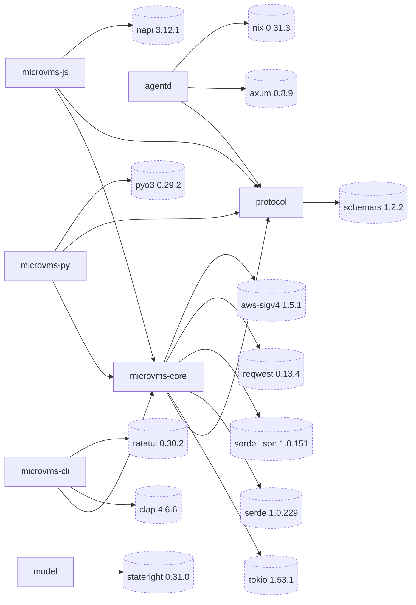

# microvms-agentd · Dependency graph

Seven crates and the third-party crates that define each one's external interface. The
workspace declares its members in `Cargo.toml:2-10` under `resolver = "3"` (`Cargo.toml:11`),
and every member inherits `edition = "2024"` from `[workspace.package]` (`Cargo.toml:22-23`).

Internal nodes are plain rectangles; external crates are cylinders with a dashed stroke. Each
external label carries the version `Cargo.lock` resolves, not the manifest's requirement string.

## Legend (overflow)

The diagram carries twenty nodes: the seven members and thirteen externals. Every other direct
dependency is below. `Edges` is the number of internal-to-external edges the
crate would draw — one per member that declares it. `Refs` counts path-qualified references
across all members' `src/`, matching only where the crate name starts a path segment, so
`axum::http::` does not count toward `http`, `std::os::unix::` does not count toward `nix`, and
`tower_http::` does not count toward either.

| Elided dependency | Edges | Refs | Declared by |
| --- | --- | --- | --- |
| tracing 0.1.44 | 1 | 60 | `agentd/Cargo.toml:52` |
| futures-util 0.3 | 2 | 15 | `agentd/Cargo.toml:54`, `microvms-core/Cargo.toml:105` |
| base64 0.23 | 2 | 13 | `agentd/Cargo.toml:60`, `microvms-core/Cargo.toml:110` |
| napi-derive 3 | 1 | 10 | `microvms-js/Cargo.toml:49` |
| tempfile 3 | 1 | 10 | `agentd/Cargo.toml:51` |
| aws-credential-types 1.3 | 1 | 6 | `microvms-core/Cargo.toml:65` |
| zip 8.6 | 1 | 6 | `microvms-core/Cargo.toml:93` |
| http 1.5.0 | 1 | 6 | `microvms-core/Cargo.toml:82` |
| tar 0.4.46 | 1 | 4 | `agentd/Cargo.toml:43` |
| rust_decimal_macros 1.40 | 1 | 4 | `microvms-core/Cargo.toml:47` |
| aws-config 1.10 | 1 | 3 | `microvms-core/Cargo.toml:59-64` |
| tower-http 0.6 | 1 | 3 | `agentd/Cargo.toml:25` |
| rust_decimal 1.42 | 1 | 2 | `microvms-core/Cargo.toml:46` |
| tracing-subscriber 0.3 | 1 | 2 | `agentd/Cargo.toml:53` |
| http-body-util 0.1 | 1 | 2 | `agentd/Cargo.toml:37` |
| bytes 1 | 1 | 2 | `agentd/Cargo.toml:38` |
| thiserror 2.0.19 | 1 | 1 | `microvms-core/Cargo.toml:32` |
| sha2 0.11 | 1 | 1 | `microvms-core/Cargo.toml:98` |
| backon 1.6 | 1 | 1 | `microvms-core/Cargo.toml:86` |
| subtle 2.6 | 1 | 1 | `agentd/Cargo.toml:44` |
| tokio-util 0.7 | 1 | 1 | `agentd/Cargo.toml:55` |
| napi-build 2 | 1 | 0 | `microvms-js/Cargo.toml:66`, build-dependency |

Thirteen seated plus twenty-two elided is the complete direct-dependency union: thirty-five
distinct third-party crates across the seven manifests.

A low count does not mean a weak edge. `http` is called in exactly one file: all six references
build the `http::Request` that `aws-sigv4` signs and that `reqwest` 0.13 consumes through
`TryFrom`, at `microvms-core/src/control/transport.rs:515`, `:531`, `:580`, `:1241`, `:1282`,
`:1496`. `thiserror`, `sha2`, and `backon` each land at a single derive or call site, and
`aws-config`'s whole surface is one `load()`.

Which thirteen got a node therefore follows architectural role rather than reference count: one
per member for the runtime, the wire codec, the schema generator, the HTTP server, the syscall
layer, the HTTP client, the request signer, the argument parser, the TUI, and each binding's FFI
crate. That seats `aws-sigv4` at 3 references and drops `tracing` at 60, which is the highest
count on the page without a node. Both counts are published so the ranking is inspectable rather
than implied by node placement.

`napi-build` draws an edge but has no `napi_build::` path reference because its whole surface is
one call in a build script, `napi_build::setup()` at `microvms-js/build.rs:12`. Omitting it does
not warn — it produces undefined-symbol link failures (`microvms-js/build.rs:8-9`).

Dev-dependencies are out of the diagram's scope, which elides the test tiers: `proptest` 1.11
and `turmoil` 0.7.2 appear in both `agentd/Cargo.toml:72-79` and
`microvms-core/Cargo.toml:112-126`, alongside `hyper` 1.11, `hyper-util` 0.1 and `tower` 0.5.
`stateright` is on the diagram because it is a normal dependency of `model`
(`model/Cargo.toml:9-10`), not a dev-dependency.

## Direction is asserted, not conventional

`microvms-cli/tests/dependency_direction.rs` reads `cargo metadata`'s resolved graph and
asserts the edges among `microvms-cli`, `microvms-core`, `microvms-py`, and `microvms-js` as
**equalities** rather than absences. The reason is written into the file: `assert!(no edge from
A to B)` passes when A has no dependencies at all, which is what a stub crate looks like, so an
equality is what fails both for a binding that grows an edge to the CLI and for a binding that
never grows its edge to core (`microvms-cli/tests/dependency_direction.rs:9-14`). The same file
asserts `microvms-cli` exposes no `lib` target, making "nothing a binding needs lives in the
CLI" a property rather than a request (`microvms-cli/tests/dependency_direction.rs:16-21`,
`microvms-cli/Cargo.toml:10-20`).

`microvms-core` depending on the CLI would make every consumer of the library, both bindings
included, carry `clap`, `ratatui`, and a multi-thread tokio runtime
(`microvms-cli/tests/dependency_direction.rs:63-65`).

## The CLI's dependency set is a denylist under test

`microvms-cli` takes the maintained crates it needs, thirteen direct dependencies today
(`microvms-cli/Cargo.toml:35-128`), and nothing polices that count: the manifest's own comment
states the rule as "dependencies are otherwise welcome" (`microvms-cli/Cargo.toml:25-34`). What is
under test is the hazard. `microvms-cli/tests/thinness.rs:49` holds `const FORBIDDEN: [&str; 12]`,
naming `reqwest`, `hyper`, `hyper-util`, `http`, `aws-config`, `aws-sdk-s3`, `aws-sdk-sts`,
`aws-sigv4`, `aws-credential-types`, `aws-smithy-runtime`, `rusoto_core`, and `ureq`, and
`no_direct_dependency_is_a_second_path_to_aws` (`microvms-cli/tests/thinness.rs:96`) reads the
manifest through `cargo metadata` and fails if any of them appears as a normal or dev dependency.
The earlier six-crate allowlist, and the `RETIRED` record of `futures-util` leaving it, were
removed with it: a cap on the manifest asserted a size, while the denylist asserts the property
CLI-2 names, that every AWS call goes through `microvms-core`.

## Absent edges that carry weight

- **`microvms-cli` has no `protocol` edge.** The wire types are reached through
  `microvms_core::protocol::`, core's re-export, so the CLI has one door to everything below it
  (`microvms-cli/Cargo.toml:48-51`). Confirmed in the source: `microvms-cli/src` contains no
  bare `protocol::` path — every one of the 25 references is qualified through core, as at
  `microvms-cli/src/commands/attached.rs:178`.
- **Both bindings do have a direct `protocol` edge**, and it is live rather than vestigial:
  `microvms-py/src/session.rs:73` and `microvms-js/src/session.rs:85` name
  `protocol::health::Health` directly, and both build `protocol::exec::StartRequest`
  (`microvms-py/src/session.rs:338`, `microvms-js/src/session.rs:143`). Core's public signatures
  already return these types, so a binding that mapped them without naming the crate would
  re-declare their fields, which is the drift `protocol` was extracted to prevent
  (`microvms-py/Cargo.toml:27-32`, `microvms-js/Cargo.toml:22-25`).
- **`agentd` reaches no AWS crate and no HTTP client.** Its 18 direct dependencies
  (`agentd/Cargo.toml:10-70`) contain no `reqwest` and no `aws-*`; it is a server, and the crate
  that talks to AWS is `microvms-core`, which runs on the developer host rather than in the
  MicroVM image (`microvms-core/Cargo.toml:56-58`).
- **`agentd` does not declare `http` either**, though it uses those types constantly. Every one
  of its `http::` references is qualified through axum's re-export — `axum::http::StatusCode`
  (`agentd/src/routes.rs:6`), `axum::http::HeaderMap` (`agentd/src/auth.rs:40`),
  `axum::http::header::CONTENT_TYPE` (`agentd/src/exec.rs:1582`) — so the daemon carries no
  second path to the `http` version axum already fixes.
- **`model` has no workspace edge at all.** `model/src/client.rs:58` says it mirrors
  `microvms_core::sandbox::Lifecycle` "by convention rather than by dependency". Its single
  dependency is `stateright` (`model/Cargo.toml:9-10`), which is why it appears on the diagram
  with exactly one edge.
- **`microvms-core` declares no `axum`.** The `axum::serve::Listener` named at
  `microvms-core/src/session/http.rs:15` is a module comment drawing an analogy, not an import.

## Shared substrate

Four dependencies are declared by more than one member. Each gets one edge on the diagram,
sourced at the member with the most references, so a single edge is not a claim of exclusivity.
Per-member reference counts:

| Dependency | agentd | microvms-core | microvms-cli | microvms-py | microvms-js | protocol |
| --- | --- | --- | --- | --- | --- | --- |
| tokio | 119 | 183 | 49 | 9 | 11 | — |
| serde_json | 19 | 114 | 85 | — | — | 31 |
| serde | 6 | 59 | 7 | — | — | 27 |
| schemars | 1 | — | — | — | — | 4 |

The feature sets differ where the role differs, and the manifests say why. `microvms-cli` takes
`rt-multi-thread` because it is the process and therefore the thing entitled to choose a
runtime; `microvms-core` deliberately carries no runtime feature at all, because a library does
not choose its caller's (`microvms-cli/Cargo.toml:65-69`, `microvms-core/Cargo.toml:101-104`).
`microvms-js` takes only `time` and `sync` because napi owns the runtime
(`microvms-js/Cargo.toml:50-53`), while `microvms-py` takes `rt-multi-thread` for one runtime
blocked on with the GIL released (`microvms-py/Cargo.toml:39-42`).

`schemars` is pinned to the identical version with the identical two features in both crates
that carry it, and `preserve_order` must stay off, because the committed `docs/schema.json` is
byte-compared in CI and key order therefore has to be a function of the types rather than of
derive order (`protocol/Cargo.toml:12-16`, `agentd/Cargo.toml:61-70`).

## Version pins the manifests argue for

Several externals carry a version floor with a defect behind it rather than a preference:

- `tar = "0.4.46"` — at least 0.4.45 is required because RUSTSEC-2026-0068 fixed a PAX
  size-header desync that let one archive parse differently across extractors
  (`agentd/Cargo.toml:41-43`).
- `tower-http = "0.6"` and not 0.7 — axum 0.8.9 pins `^0.6.8` internally, so 0.6 keeps one
  version of the middleware types in the tree. Its `catch-panic` layer is load-bearing: the
  daemon is the only channel into the VM, so a panic that kills a connection makes the VM
  unreachable for good (`agentd/Cargo.toml:17-25`). That layer is implemented with
  `catch_unwind`, which is why the release profile overrides `panic` back to `"unwind"`
  (`Cargo.toml:39-57`).
- `nix = "0.31"` — a caret on 0.31 is the widest safe range because nix is pre-1.0 and every
  minor is a breaking change. Four features, each named for a call site: `signal` for the exec
  kill path, `fs` for the `statvfs` disk-pressure guard, `mount` for the `MS_BIND` that shadows
  the read-only procfs `boot_id`, `hostname` for `sethostname` (`agentd/Cargo.toml:45-50`).
- `aws-config` keeps `default-https-client` **on** — the credential chain does its own HTTP for
  IMDS, SSO, and STS through smithy's client and panics at `load()` without one. The price is
  two HTTP stacks, smithy for credentials and reqwest for service calls; both sit on rustls, so
  it is one TLS implementation (`microvms-core/Cargo.toml:50-64`).
- `aws-sigv4` rather than a generated SDK — `lambda-microvms` has no aws-sdk-rust crate, so the
  choice was between vendoring smithy codegen and signing 24 rest-json operations by hand
  (`microvms-core/Cargo.toml:50-52`).
- `reqwest` with `rustls` and not `default-tls`, because the daemon ships to an aarch64 musl
  target where a native-tls build needs an OpenSSL the image does not carry. `json` is off
  deliberately, so the error path can read a raw body and see an `AccessDeniedException` whose
  message field is null (`microvms-core/Cargo.toml:71-81`).
- `zip = "8.6"` with `deflate` only — 9.0 exists only as `9.0.0-pre2`, and a pre-release in a
  shipping manifest is a version that can change under you; the other compressors are C
  libraries that would otherwise have to build for the musl target
  (`microvms-core/Cargo.toml:87-93`).
- `rust_decimal` with `serde-with-str` — the ARM rates are figures like `0.0000276944` and
  summing a few thousand in binary floating point drifts toward a bill nobody can reproduce
  (`microvms-core/Cargo.toml:40-46`).
- `napi` at `napi5` rather than `napi4`, forced rather than chosen: napi 3.12's `web_stream`
  declares only `napi4`, but its `ReadableStream` finalizer calls `napi_add_finalizer`, which
  `napi-sys` gates behind `napi5` (`microvms-js/Cargo.toml:37-43`).
- `pyo3` with `abi3-py39` and **no** `extension-module` feature. That feature is deprecated, and
  enabling it disables libpython linking for every target in the workspace, breaking
  `cargo test` with undefined `_PyExc_*` symbols; maturin sets `PYO3_BUILD_EXTENSION_MODULE`
  itself for a wheel build (`microvms-py/Cargo.toml:33-38`,
  `microvms-py/pyproject.toml:5-9`).

## Crate-type asymmetry between the bindings

`microvms-py` is `crate-type = ["cdylib", "rlib"]`: the cdylib is what Python imports, the rlib
is what lets `tests/` and doctests link the crate, and cdylib alone produces E0432/E0463 for
anything that tries to `use` it (`microvms-py/Cargo.toml:13-19`). `microvms-js` is `cdylib`
only, because a Node addon is loaded by the runtime and nothing in this workspace links it — the
smoke test drives the built `.node` through `node --test` rather than through `cargo test`
(`microvms-js/Cargo.toml:12-17`, `microvms-js/package.json:13`).

Neither crate publishes. `publish = false` is inherited workspace-wide
(`Cargo.toml:26-32`), the bindings restate it (`microvms-py/Cargo.toml:11`,
`microvms-js/Cargo.toml:10`), and the npm side says the same thing with `"private": true`
(`microvms-js/package.json:5`).

## See also

- [impact analysis](../../insights/impact-analysis.md) — 12 shared source citations
- [system overview](../../architecture/system-overview.md) — 9 shared source citations
- [contract map](../../insights/contract-map.md) — 8 shared source citations
- [tech debt](../../insights/tech-debt.md) — 8 shared source citations
- [business logic](../../insights/business-logic.md) — 6 shared source citations
