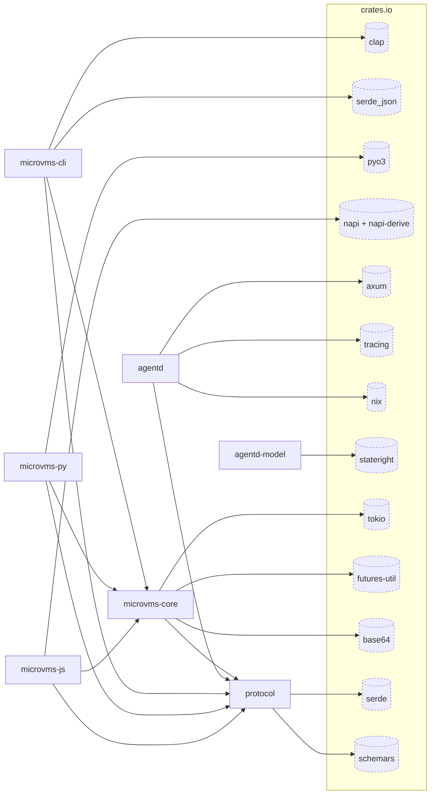

# microvms-agentd · Dependency graph

This diagram shows the seven workspace crates and the external crates they
import most often. Solid rectangles are workspace members. Dashed cylinders
are third-party crates from crates.io.

The `crates.io` box is a grouping, not a node. Without it the layout engine
routes internal edges straight through external node boxes, which reads as a
dependency that does not exist.

## Reading the internal edges

`protocol` is the sink: it depends on no workspace member, and five of the
other six depend on it. The crate was extracted to create exactly this shape.
The daemon and every client name the same types, so a field renamed in
`protocol` breaks the build on both sides of the wire instead of surfacing at
runtime
(`protocol/Cargo.toml:7`, `microvms-core/Cargo.toml:23-28`).

`microvms-core` is the only crate the three consumers share. The CLI, the
Python binding, and the Node binding each depend on it and on nothing else in
the workspace beyond `protocol`.

Three edges are deliberately absent. Each absence is asserted by a test
rather than left to convention:

- **Nothing depends on `microvms-cli`.** It declares one `[[bin]]` and no
  `src/lib.rs` (`microvms-cli/Cargo.toml:9-19`), so it exports nothing another
  crate could name. Two tests hold this: `the_cli_exports_no_library_target_at_all`
  (`microvms-cli/tests/dependency_direction.rs:126`) fails as soon as a `lib`
  target appears, before any crate can use it, and
  `no_workspace_crate_depends_on_the_cli` (`:219`) covers every member with no
  exception list.
- **No edge from `agentd` to `microvms-core`.** The daemon ships into the
  MicroVM image; the core runs on the developer host and carries the AWS
  control-plane stack (`microvms-core/Cargo.toml:56-57`). They share only the
  wire types.
- **`agentd-model` stands alone.** Its one dependency is `stateright`
  (`model/Cargo.toml:8-9`). It is an executable specification of the bootstrap
  and exec lifecycle whose reachable states stateright enumerates exhaustively
  (`model/src/lib.rs:2-9`), and it holds no daemon code. An edge into the
  implementation would let a bug in the code define the property the model
  exists to check.

`microvms-cli` keeps its direct edge to `protocol` even though
`microvms-core` re-exports the crate (`pub use protocol;`,
`microvms-core/src/lib.rs:77`). The edge is allowlisted by
`the_direct_dependency_set_is_exactly_the_allowed_one`
(`microvms-cli/tests/thinness.rs:146`). That test asserts equality against a
fixed set instead of checking a denylist, so any unlisted dependency fails the
build.

The guard's comment says "Six normal dependencies"
(`microvms-cli/tests/thinness.rs:134`, and the same count at
`microvms-cli/Cargo.toml:23`, `:38`, `:90-91`). The `ALLOWED` table it asserts
against holds seven: `microvms-core`, `protocol`, `clap`, `ratatui`, `serde`,
`serde_json`, `tokio` (`microvms-cli/tests/thinness.rs:64`). `cargo metadata`
confirms seven normal dependencies, so the count in the comment is stale. The
equality assertion itself is correct, and the assertion is the part that gates
the build.

## Reading the external edges

Each external crate is drawn once, sourced at the member whose files import it
most. `serde_json` sources at `microvms-cli` because 13 of its files name it
against `microvms-core`'s 9. `tokio` sources at `microvms-core` (10 files),
though five of the seven members declare it.

Ranking is by file count, so it measures how widely a crate is spread rather
than how much the design rests on it. The AWS control-plane stack shows the
difference. `reqwest`, `aws-config`, `aws-credential-types`, `aws-sigv4`, and
`backon` all sit in one or two files under `microvms-core/src/control/`, so
they rank near the bottom and fall into the overflow table below, even though
they carry the substance of what the crate does. A crate in that table was cut
for space, not because it is peripheral.

Dev-dependencies are excluded. `turmoil`, `proptest`, `hyper`, `hyper-util`,
`tower`, and `cargo_metadata` are test-only and appear in no edge.

## Legend (overflow)

33 external crates are declared as normal dependencies across the workspace.
14 crate names are drawn above, in 13 nodes (`napi` and `napi-derive` share
one). The 19 below were elided to hold the 20-node budget. Each would have
drawn exactly one edge, from the member named in the third column. Counts are
source files naming the crate, comment lines excluded.

| Crate | Files | Would source at |
| --- | --- | --- |
| `tempfile` | 4 (1 outside `cfg(test)`) | `agentd` |
| `http` | 2 | `microvms-core` |
| `http-body-util` | 2 | `agentd` |
| `reqwest` | 2 | `microvms-core` |
| `aws-config` | 1 | `microvms-core` |
| `aws-credential-types` | 1 | `microvms-core` |
| `aws-sigv4` | 1 | `microvms-core` |
| `backon` | 1 | `microvms-core` |
| `bytes` | 1 | `agentd` |
| `ratatui` | 1 | `microvms-cli` |
| `rust_decimal` | 1 | `microvms-core` |
| `rust_decimal_macros` | 1 | `microvms-core` |
| `subtle` | 1 | `agentd` |
| `tar` | 1 | `agentd` |
| `thiserror` | 1 | `microvms-core` |
| `tokio-util` | 1 | `agentd` |
| `tower-http` | 1 | `agentd` |
| `tracing-subscriber` | 1 | `agentd` |
| `zip` | 1 | `microvms-core` |

`tempfile` outranks the drawn `stateright` on raw file count, but three of its
four uses are inside `#[cfg(test)]` blocks (`agentd/src/disk.rs:262`,
`agentd/src/exec.rs:1370`, `agentd/src/identity.rs:418`). Its single runtime
use is the unlinked upload spool (`agentd/src/fs.rs:503`), which puts it below
`stateright` at runtime.

## Source

Edges come from `cargo metadata --format-version 1 --no-deps`, filtered to
dependencies whose `kind` is null. That resolves path dependencies and
workspace inheritance, so an edge added through a renamed key still shows up.
Import counts come from grepping `use <crate>` and `<crate>::` across each
member's `src/`, with comment lines stripped first.

## See also

- [microvms-agentd · Tech debt](../../insights/tech-debt.md)
- [microvms-agentd · System overview](../../architecture/system-overview.md)
- [microvms-agentd · Impact analysis](../../insights/impact-analysis.md)
- [microvms-agentd · Business logic](../../insights/business-logic.md)
- [microvms-agentd · Contract map](../../insights/contract-map.md)
